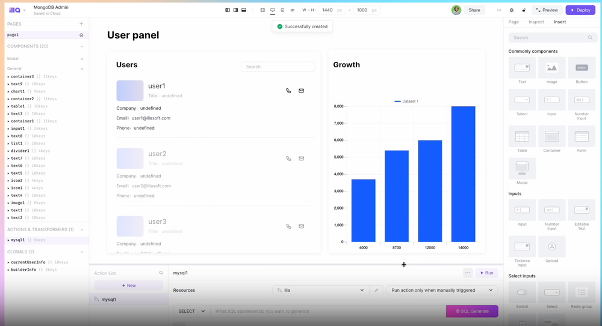

<!-- generated -->

# Illa

1-Click installation template for Illa on Easypanel

## Description

Illa Cloud is a revolutionary browser-based code editor designed to streamline and modernize the process of website development. It allows you to code directly within your web browser, either online or offline, eliminating the need for multiple programs. With Illa Cloud, you can test your sites on actual web servers and maintain them with ease after development, making for a fast and intelligent development process. It&#39;s not just limited to online use - you can also use it as a desktop code editor, provided you have PHP 7.0+. It comes packed with a multitude of features and plugins to enhance your coding experience, including multiple cursors, 80+ highlighting themes, a find &amp; replace builder, login security, coding assistance, visual code difference display, and database management with the Adminer plugin. The latest version, Illa Cloud 8.1, introduces regex search on find and replace, double click tab to collapse file manager, active line number highlighting, and many more improvements and bug fixes.

## Instructions

Defualt username; root and password; password

## Benefits

- Modern Approach to Website Building: Illa Cloud provides a modern approach to building websites by allowing you to code directly within the web browser, online or offline. This means you only need one program (your browser) to develop sites, and you can test on actual web servers.
- Easy Maintenance: After development, maintaining the website is easy with Illa Cloud. This makes for speedy and smart development.
- Accessible Anywhere: As Illa Cloud is web-based, you can use it from any internet-enabled computer with a modern browser.
- Customizable: Illa Cloud is built with common web languages, allowing you to customize it to your liking and integrate it with online services.
- Desktop Code Editor: If you'd like to use Illa Cloud as a desktop code editor, no problem. You only need PHP 7.0+, so you can use it on Linux, PC via WAMP or XAMPP, and Mac via MAMP (or another PHP installation).

## Features

- Multiple Cursors: Create multiple cursors and make text changes to affect all of them simultaneously.
- Themes: 80+ highlighting themes come as standard but you can easily make your own with a CSS file.
- Find & Replace Builder: Find and replace can be applied to the current or all open documents, plus filenames & files.
- Login Secured: Illa Cloud can be set up wherever you wish and is login secured to help keep your files safe. It's multi-user too!
- Type Boosters: Plenty of coding assist is available such as Emmet, close tag completion, and tag wrappers.
- Visual Code Diff: Have code differences between 2 sets shown visually, including in-line highlighting of changes.
- Code Hints: Your JavaScript code is linted with JS Hint as you type to ensure good coding practices.
- Database Management: Database management is easy with the Adminer plugin. It's like phpMyAdmin, but better.

## Links

- [Website](https://illacloud.com/)
- [Documentation](https://docs.illacloud.com/)
- [Template Source](https://github.com/easypanel-io/templates/tree/main/templates/illa)

## Options

Name | Description | Required | Default Value
-|-|-|-
App Service Name | - | yes | illa
App Service Image | - | yes | illasoft/illa-builder:v4.8.5

## Screenshots

## Change Log

- 2025-01-21 – First Release

## Contributors

- [Ahson Shaikh](https://github.com/Ahson-Shaikh)
