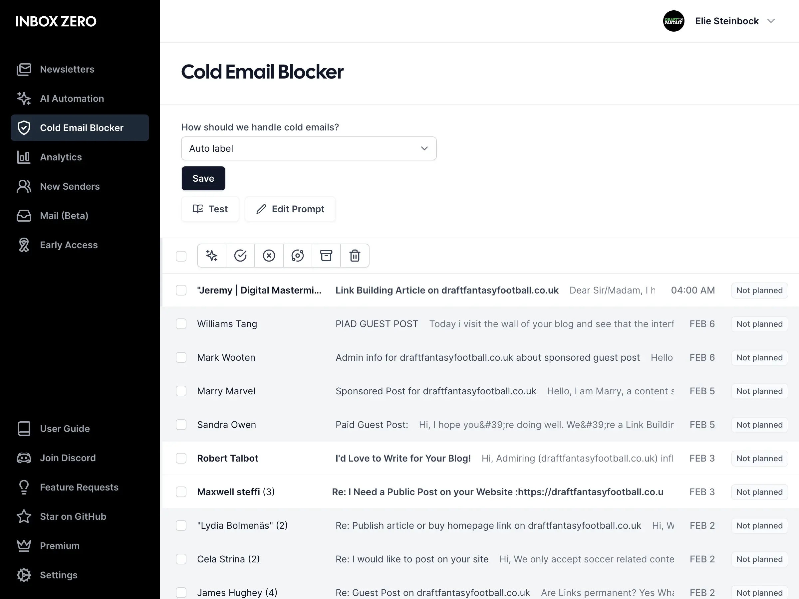

<!-- generated -->

# Inbox Zero

1-Click installation template for Inbox Zero on Easypanel

## Description

Inbox Zero is an email management platform that helps you clean your inbox, manage subscriptions, and automate email workflows.

## Instructions

The Google Client ID and Secret are required for the OAuth flow to work. Select the LLM provider and fill the API keys for the provider.

## Benefits

- Email Management: Take control of your inbox with powerful management tools
- Subscription Control: Easily manage and unsubscribe from newsletters and subscriptions
- Email Automation: Automate repetitive email tasks and workflows
- AI-Powered: Leverage AI to handle email categorization and responses
- Self-Hosted: Keep your email data private on your own server

## Features

- Email Cleanup: Declutter your inbox by quickly processing and organizing emails
- Subscription Manager: Track and manage all your email subscriptions
- Auto-Responder: Set up automated responses for common email types
- Email Filters: Create custom filters to sort and manage incoming emails
- Analytics: Track email usage and behavior over time

## Links

- [GitHub](https://github.com/elie222/inbox-zero)
- [Website](https://www.getinboxzero.com/)
- [Template Source](https://github.com/easypanel-io/templates/tree/main/templates/inbox-zero)

## Options

Name | Description | Required | Default Value
-|-|-|-
App Service Name | - | yes | inbox-zero
App Service Image | - | yes | ghcr.io/elie222/inbox-zero:v1.7.8
Google Client ID | The Google Client ID is required for the OAuth flow to work. | yes | 
Google Client Secret | The Google Client Secret is required for the OAuth flow to work. | yes | 
LLM Provider | Select the LLM provider and fill only the respective API key. | yes | openai
OpenAI API Key | - | no | 
Anthropic API Key | - | no | 
Google API Key | - | no | 
Groq API Key | - | no | 
AWS Bedrock Access Key | - | no | 
AWS Bedrock Secret Key | - | no | 
AWS Bedrock Region | - | no | us-west-2
Ollama Base URL | - | no | http://ollama:11434
Ollama Model | - | no | phi3
OpenRouter API Key | - | no | 
Economy LLM Provider | - | no | ollama
Economy LLM Model | - | no | 

## Screenshots

## Change Log

- 2025-04-15 – First Release

## Contributors

- [Ahson Shaikh](https://github.com/Ahson-Shaikh)
