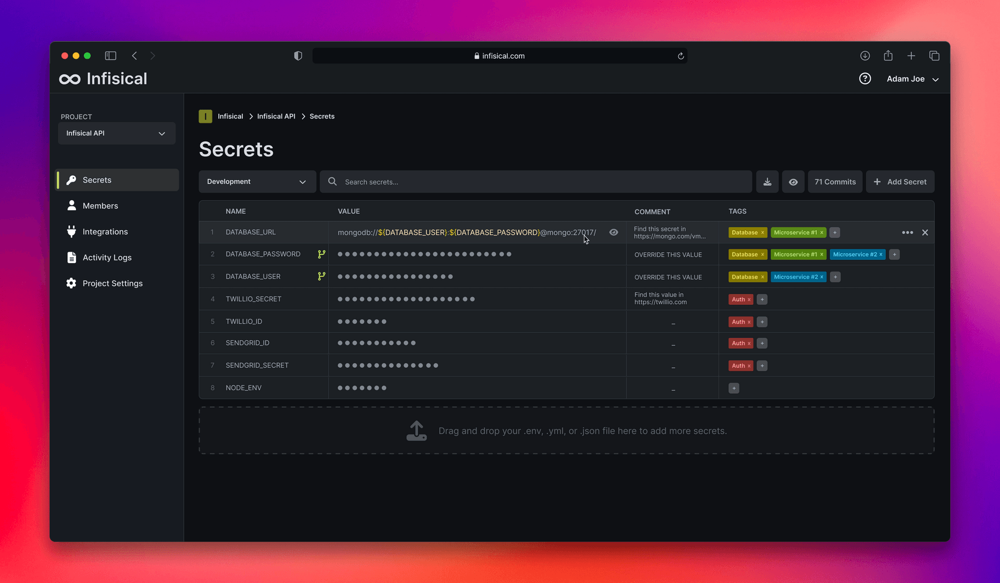

<!-- generated -->

# Infisical

1-Click installation template for Infisical on Easypanel

## Description

Infisical is a robust, self-hosted platform designed for securely managing and accessing secrets, environment variables, and API keys. It provides a user-friendly interface, seamless integration with popular development and CI/CD tools, and advanced encryption to ensure the safety of sensitive data. With Infisical, you maintain full control over your secrets infrastructure, providing enhanced security and flexibility for your workflows.

## Instructions

You may delete the migration service once the migration is completed.

## Benefits

- Secure Secret Management: Infisical provides a centralized and secure way to manage environment variables and secrets across your applications.
- Self-Hosted Privacy: Retain full control and privacy over your secrets with a self-hosted solution.
- Seamless Integration: Easily integrate Infisical with your favorite CI/CD tools, frameworks, and development environments.

## Features

- End-to-End Encryption: Protect your secrets with advanced end-to-end encryption, ensuring they remain safe and inaccessible to unauthorized parties.
- Role-Based Access Control: Manage user and team access with granular role-based permissions for better security.
- Real-Time Sync: Automatically sync secrets and environment variables across your team in real time.
- Version Control: Track changes and roll back to previous versions of secrets for better manageability.

## Links

- [Documentation](https://infisical.com/docs)
- [Github](https://github.com/Infisical/infisical)
- [Template Source](https://github.com/easypanel-io/templates/tree/main/templates/infisical)

## Options

Name | Description | Required | Default Value
-|-|-|-
App Service Name | - | yes | infisical
App Service Image | - | yes | infisical/infisical:v0.101.1-postgres

## Screenshots

## Change Log

- 2025-01-08 – Template Release

## Contributors

- [Ahson Shaikh](https://github.com/Ahson-Shaikh)
