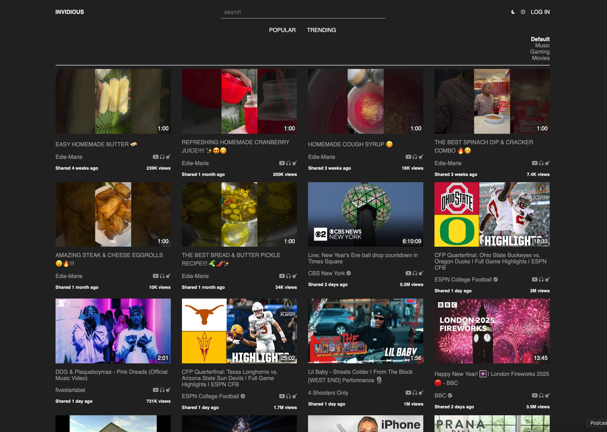

<!-- generated -->

# Invidious

1-Click installation template for Invidious on Easypanel

## Description

Invidious is a privacy-respecting alternative frontend for YouTube, designed to offer a lightweight, ad-free, and tracking-free viewing experience. It allows users to watch YouTube videos without being tracked, bypasses regional restrictions, and provides advanced features like video downloads, subscription management, and audio-only mode. Invidious supports multiple languages and offers a minimal interface with various themes for enhanced user experience. Additionally, it integrates seamlessly with other platforms by providing RSS feeds for subscriptions and API support.

## Benefits

- Ad-Free and Privacy-Respecting: Invidious allows users to watch YouTube videos without ads or tracking, ensuring a private and seamless experience.
- Lightweight and Fast: Designed for efficiency, Invidious consumes minimal resources, making it ideal for low-powered devices or self-hosting.
- Enhanced Accessibility: Offers features like video downloads, audio-only mode, and support for RSS feeds, enabling users to access content in flexible ways.

## Features

- Ad-Free Video Playback: Watch YouTube videos without interruptions from ads or intrusive tracking scripts.
- Audio-Only Mode: Save bandwidth by streaming only the audio of videos, perfect for music or podcasts.
- Subscription Management: Keep track of your favorite channels with subscription management, available via  RSS feeds for external readers.
- Customizable Themes: Personalize your experience with various themes and a clean, minimal interface.
- Open Source and Community-Driven: Invidious is free and open source, with active contributions from a vibrant community.

## Links

- [Website](https://invidious.io/)
- [Documentation](https://docs.invidious.io/)
- [GitHub](https://github.com/iv-org/invidious)
- [Template Source](https://github.com/easypanel-io/templates/tree/main/templates/invidious)

## Options

Name | Description | Required | Default Value
-|-|-|-
App Service Name | - | yes | invidious
App Service Image | - | yes | quay.io/invidious/invidious:dbee027ed9b568469815b319332e029964bff7fb-quic

## Screenshots

## Change Log

- 2024-01-03 – First release

## Contributors

- [Ahson Shaikh](https://github.com/Ahson-Shaikh)
