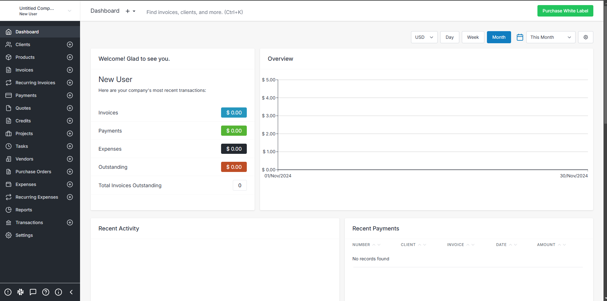

<!-- generated -->

# InvoiceNinja

1-Click installation template for InvoiceNinja on Easypanel

## Description

Invoice Ninja is a powerful, open-source platform for managing invoices, quotes, and payments, specifically designed for freelancers and small businesses. It allows you to automate billing, track payments, and manage expenses effortlessly. With a user-friendly interface and robust feature set, Invoice Ninja supports multi-currency, recurring billing, and various payment gateways, providing a comprehensive invoicing solution.

## Instructions

Open the nginx domain to access InvoiceNinja

## Benefits

- Streamlined Invoicing: Invoice Ninja simplifies invoicing with customizable templates, recurring invoices, and the ability to track payments and expenses effortlessly.
- Payment Integration: Invoice Ninja supports multiple payment gateways, including Stripe and PayPal, enabling seamless and flexible payment processing for your clients.
- Multi-Currency Support: With support for multiple currencies and languages, Invoice Ninja is ideal for businesses operating internationally.

## Features

- Recurring Invoices: Automate billing with recurring invoices and subscriptions.
- Payment Gateways: Integrate with popular payment gateways like Stripe, PayPal, and others for easy payment processing.
- Expense Tracking: Manage your expenses and link them directly to invoices for better accounting.
- Client Portal: Provide your clients with a portal where they can view and pay invoices directly.
- Customizable Templates: Use professionally designed templates or customize them to reflect your brand.

## Links

- [Github](https://github.com/invoiceninja/invoiceninja)
- [Documentation](https://invoiceninja.github.io/docs/)
- [Demo](https://demo.invoiceninja.com)
- [Template Source](https://github.com/easypanel-io/templates/tree/main/templates/invoiceninja)

## Options

Name | Description | Required | Default Value
-|-|-|-
App Service Name | - | yes | invoiceninja
App Service Image | - | yes | invoiceninja/invoiceninja:5.10
Nginx Image | - | yes | nginx:1.27
Admin Email | - | yes | admin@example.com
Admin Password | - | yes | 

## Screenshots

## Change Log

- 2024-11-21 – First Release

## Contributors

- [Ahson Shaikh](https://github.com/Ahson-Shaikh)
