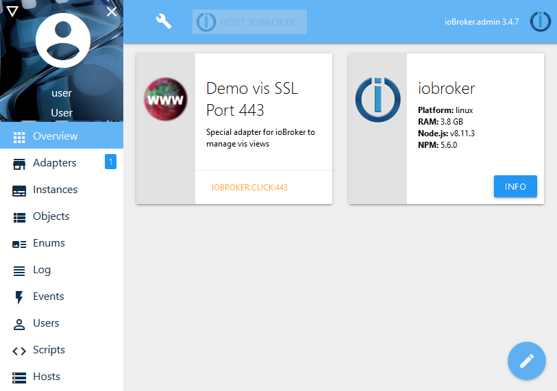

<!-- generated -->

# ioBroker

1-Click installation template for ioBroker on Easypanel

## Description

ioBroker is a powerful open-source IoT platform that allows you to connect different smart home systems and devices into one platform. It supports a wide range of protocols and devices, making it a versatile solution for home automation.

## Benefits

- Unified Smart Home Platform: Connect and control all your smart home devices from a single interface
- Extensive Protocol Support: Supports multiple protocols including Zigbee, Z-Wave, MQTT, and more
- Customizable Automation: Create complex automation rules and scenarios
- Open Source: Free and open-source platform with active community support

## Features

- Multi-Protocol Support: Connect devices using various protocols and standards
- Visualization: Create custom dashboards and visualizations
- Scripting: Advanced scripting capabilities for custom automation
- History & Logging: Store and analyze historical data
- Mobile Access: Access your smart home from anywhere using mobile apps
- Backup & Restore: Easy backup and restore functionality
- Plugin System: Extend functionality with community plugins

## Links

- [Website](https://www.iobroker.net)
- [Documentation](https://www.iobroker.net/#en/documentation)
- [GitHub](https://github.com/ioBroker/ioBroker)
- [Docker Hub](https://hub.docker.com/r/buanet/iobroker)
- [Template Source](https://github.com/easypanel-io/templates/tree/main/templates/iobroker)

## Options

Name | Description | Required | Default Value
-|-|-|-
App Service Name | - | yes | iobroker
App Service Image | - | yes | buanet/iobroker:v11.1.0

## Screenshots

## Change Log

- 2025-04-30 – Initial release
- 2026-05-01 – Version bumped to v11.1.0

## Contributors

- [Ahson Shaikh](https://github.com/Ahson-Shaikh)
