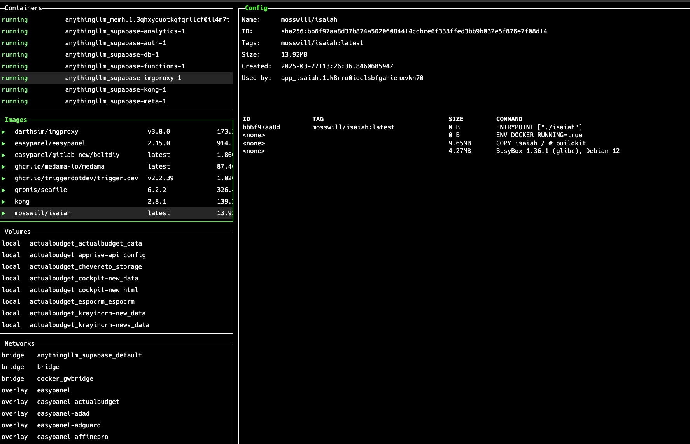

<!-- generated -->

# Isaiah

1-Click installation template for Isaiah on Easypanel

## Description

Isaiah is a Docker-based application that provides a simple and efficient way to manage containerized applications. It offers a web interface for monitoring and controlling Docker containers with a clean, user-friendly interface. Isaiah allows you to view container status, logs, and resource usage, making it easier to maintain your Docker infrastructure.

## Instructions

Access the web interface to manage your Docker containers

## Benefits

- Container Management: Easily manage your Docker containers through a clean web interface. Isaiah provides a simple way to monitor and control your containerized applications.
- Lightweight Solution: Isaiah is designed to be lightweight and resource-efficient while providing powerful container management capabilities. It runs with minimal overhead on your system.
- Secure Access: Protect your container management interface with authentication. Isaiah ensures that only authorized users can access and manage your Docker containers.

## Features

- Docker Container Monitoring: Monitor the status and health of your Docker containers in real-time through an intuitive web interface.
- Container Management: Start, stop, restart, and remove containers directly from the web interface without needing command-line access.
- Resource Usage Tracking: Keep track of container resource usage including CPU, memory, and network usage to optimize your infrastructure.
- Container Logs Access: Access and search container logs directly through the web interface for easier troubleshooting and monitoring.
- Simple and Intuitive Interface: Isaiah features a clean, user-friendly interface that makes Docker container management accessible to users of all technical levels.

## Links

- [Docker](https://hub.docker.com/r/mosswill/isaiah)
- [GitHub](https://github.com/will-moss/isaiah)
- [Template Source](https://github.com/easypanel-io/templates/tree/main/templates/isaiah)

## Options

Name | Description | Required | Default Value
-|-|-|-
App Service Name | - | yes | isaiah
App Service Image | - | yes | mosswill/isaiah:latest

## Screenshots

## Change Log

- 2025-04-17 – first release

## Contributors

- [Ahson Shaikh](https://github.com/Ahson-Shaikh)
