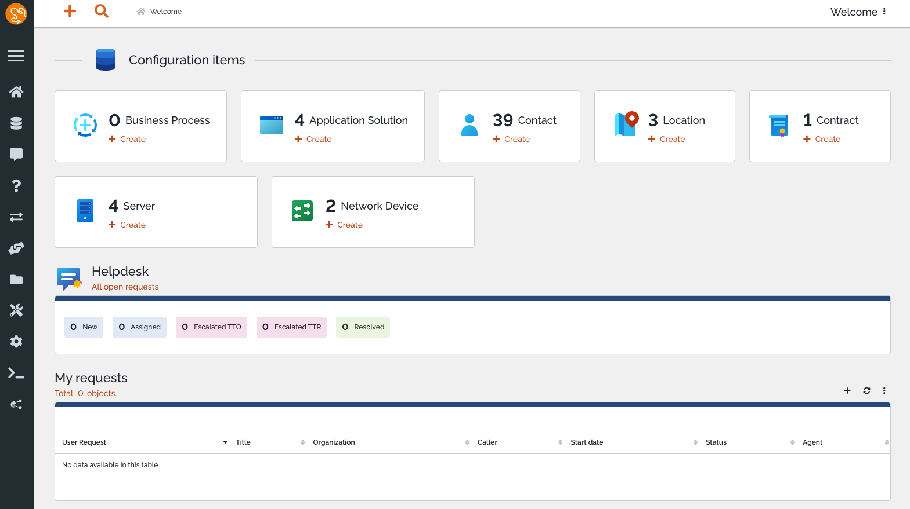

<!-- generated -->

# iTop

1-Click installation template for iTop on Easypanel

## Description

iTop is a self-hosted, open-source IT service management (ITSM) solution designed for businesses and organizations to manage their IT assets, incidents, and workflows efficiently. It provides a modern web interface for tracking and organizing IT infrastructure, support tickets, change requests, and service catalogs. iTop includes role-based user management, real-time notifications, and detailed reporting tools to help IT teams maintain operational efficiency. It supports multiple authentication methods, including LDAP and SAML, making it suitable for enterprise environments. Additionally, iTop offers API access for integration with third-party tools and automation of IT processes. Its containerized deployment ensures scalability and easy management.

## Instructions

On the installation wizard, please connect to the DB.

## Benefits

- Comprehensive IT Asset Management: iTop provides a structured way to track and manage IT assets, including servers, workstations, software, and configurations.
- Self-Hosted ITSM Solution: Businesses can maintain full control over their IT operations, ensuring security, compliance, and customization without relying on third-party services.
- ITIL-Compliant Incident & Change Management: iTop follows ITIL best practices for managing incidents, changes, and service requests, helping organizations streamline their IT operations.

## Features

- CMDB (Configuration Management Database): iTop provides a centralized database to document and manage IT assets, relationships, and dependencies.
- Service Desk & Incident Management: Manage and track IT incidents, requests, and changes with a built-in service desk system.
- Workflow Automation & API Integration: Automate IT processes and integrate iTop with monitoring tools, ticketing systems, and third-party applications.
- Role-Based Access Control: Define user roles and permissions to ensure secure access to IT data.
- Reporting & Dashboards: Gain insights into IT performance with built-in reports, analytics, and customizable dashboards.

## Links

- [Documentation](https://www.itophub.io/wiki/page)
- [Github](https://github.com/Combodo/iTop)
- [Template Source](https://github.com/easypanel-io/templates/tree/main/templates/itop)

## Options

Name | Description | Required | Default Value
-|-|-|-
App Service Name | - | yes | itop
App Service Image | - | yes | vbkunin/itop:3.2.2

## Screenshots

## Change Log

- 2025-03-18 – Template Release
- 2025-12-25 – Version bumped to 3.2.2

## Contributors

- [Ahson Shaikh](https://github.com/Ahson-Shaikh)
