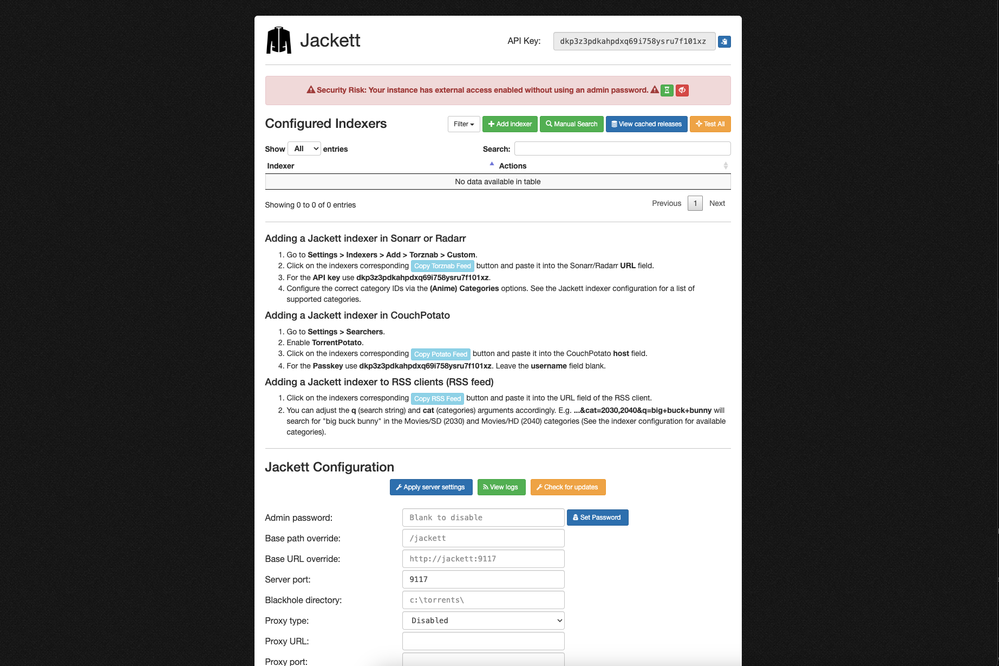

<!-- generated -->

# Jackett

1-Click installation template for Jackett on Easypanel

## Description

Jackett is a versatile, open-source indexer proxy for torrenting and Usenet, enabling users to integrate popular trackers with applications like Sonarr, Radarr, and more. Designed to be lightweight and efficient, Jackett streamlines the process of accessing trackers, offering a seamless experience for managing and automating downloads.

## Benefits

- Seamless Integration: Jackett acts as a bridge between torrent trackers and applications like Sonarr, Radarr, and Lidarr, simplifying the automation of media downloads.
- Open-Source and Free: Enjoy the benefits of a completely free and open-source solution, backed by an active community.
- Customizable and Flexible: Configure Jackett to meet your specific needs, with support for multiple trackers and platforms.

## Features

- Wide Tracker Support: Supports hundreds of public and private trackers for both torrents and Usenet.
- API Compatibility: Integrates seamlessly with popular applications via API for automated workflows.
- Cross-Platform: Available for Windows, macOS, Linux, and Docker, ensuring compatibility across all environments.
- Lightweight and Efficient: Designed to be resource-efficient, making it suitable for deployment on low-end devices or VPS.
- Regular Updates: Benefit from consistent updates and improvements supported by an active open-source community.

## Links

- [Website](https://jackett.sh/)
- [Github](https://github.com/Jackett/Jackett)
- [Template Source](https://github.com/easypanel-io/templates/tree/main/templates/jackett)

## Options

Name | Description | Required | Default Value
-|-|-|-
App Service Name | - | yes | jackett
App Service Image | - | yes | lscr.io/linuxserver/jackett:latest

## Screenshots

## Change Log

- 2024-12-25 – Template Release

## Contributors

- [Ahson Shaikh](https://github.com/Ahson-Shaikh)
