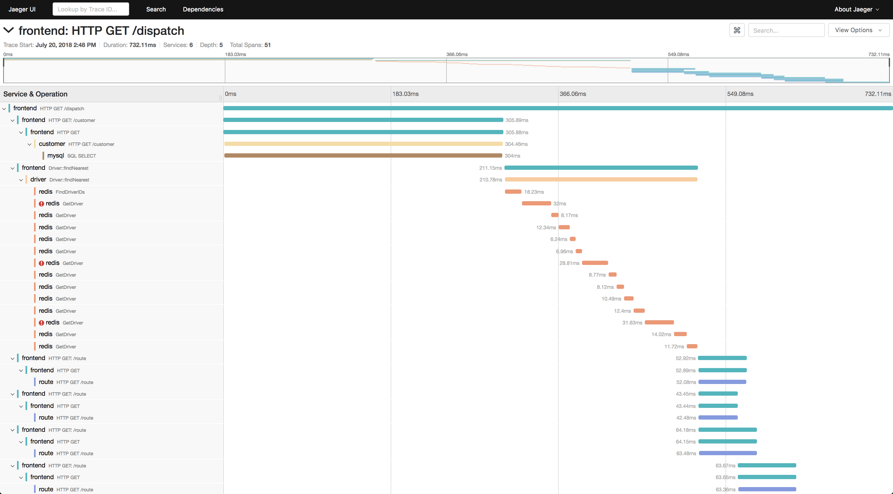

<!-- generated -->

# Jaeger

1-Click installation template for Jaeger on Easypanel

## Description

Jaeger is an end-to-end distributed tracing system used for monitoring and troubleshooting microservices-based architectures. It helps developers track requests across complex systems, visualize latencies, and diagnose performance issues. Jaeger supports multiple storage backends and provides powerful querying and visualization capabilities. It is designed to be scalable and production-ready, making it a valuable tool for debugging and optimizing distributed applications.

## Benefits

- Distributed Tracing: Track requests across microservices for better visibility.
- Performance Optimization: Identify and diagnose performance bottlenecks in distributed applications.
- Multiple Storage Backends: Supports multiple storage options such as Elasticsearch and Cassandra.
- Scalable & Production-Ready: Designed to handle high loads and large-scale applications.
- Powerful Visualization: Provides an intuitive UI for analyzing traces and latencies.
- OpenTelemetry Integration: Seamlessly integrates with OpenTelemetry for enhanced observability.

## Features

- End-to-End Tracing: Capture and analyze traces from service to service.
- Trace Visualization: View trace timelines and dependencies in an intuitive UI.
- Latency Analysis: Identify slow services and optimize performance.
- Adaptive Sampling: Control trace sampling dynamically for efficient data collection.
- Storage Flexibility: Store traces in Elasticsearch, Cassandra, Kafka, or local memory.
- OpenTelemetry Support: Natively integrates with OpenTelemetry for seamless instrumentation.

## Links

- [Website](https://www.jaegertracing.io)
- [Documentation](https://www.jaegertracing.io/docs/latest)
- [Github](https://github.com/jaegertracing/jaeger)
- [Template Source](https://github.com/easypanel-io/templates/tree/main/templates/jaeger)

## Options

Name | Description | Required | Default Value
-|-|-|-
App Service Name | - | yes | jaeger
App Service Image | - | yes | jaegertracing/all-in-one:1.76.0
Compact Format | - | yes | 5775
Jaeger Instrumentation | - | yes | 6831
Binary Format | - | yes | 6832
Port Sampling | - | yes | 5778
Collector Port | - | yes | 14268
Zipkin Port | - | yes | 9411

## Screenshots

## Change Log

- 2025-03-14 – First Release
- 2025-07-22 – Version bumped to v1.71.0
- 2025-12-25 – Version bumped to v1.76.0

## Contributors

- [Ahson Shaikh](https://github.com/Ahson-Shaikh)
