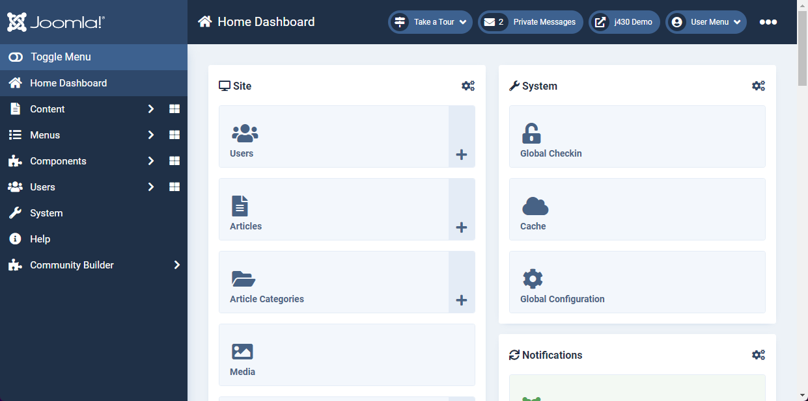

<!-- generated -->

# Joomla

1-Click installation template for Joomla on Easypanel

## Description

Joomla is a powerful, open-source content management system (CMS) that allows users to build dynamic websites and applications. It offers a user-friendly interface, extensive customization options through templates and extensions, and robust security features. Joomla is highly scalable and supports multilingual content, making it a versatile choice for businesses, organizations, and personal websites. The application is accessible via your host on standard web ports and is easy to deploy using containers.

## Instructions

Complete the Installation Wizard.

## Benefits

- Flexible and Scalable CMS: Joomla provides a powerful and flexible content management system that can scale from simple websites to complex enterprise applications.
- Extensive Customization: With thousands of extensions and templates available, Joomla allows you to customize your website to meet your needs.
- Strong Community Support: Backed by a large and active community, Joomla offers extensive documentation, forums, and developer resources.

## Features

- User Management: Joomla offers advanced user management with multiple access levels and permissions for different roles.
- Multilingual Support: Joomla supports multilingual content out of the box, making it an ideal choice for global websites.
- Built-in SEO Features: Joomla provides search engine optimization (SEO) tools to help improve your site's visibility and rankings.
- Extensions and Plugins: Extend Joomla’s functionality with thousands of extensions available in the Joomla Extensions Directory (JED).
- Security and Performance: Joomla includes built-in security measures, regular updates, and caching mechanisms to ensure optimal performance.

## Links

- [Documentation](https://docs.joomla.org)
- [Github](https://github.com/joomla/joomla-cms)
- [Template Source](https://github.com/easypanel-io/templates/tree/main/templates/joomla)

## Options

Name | Description | Required | Default Value
-|-|-|-
App Service Name | - | yes | joomla
App Service Image | - | yes | joomla:5.2.3

## Screenshots

## Change Log

- 2025-01-31 – Template Release

## Contributors

- [Ahson Shaikh](https://github.com/Ahson-Shaikh)
