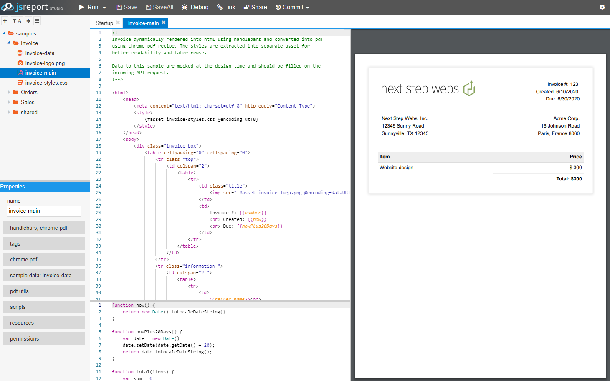

<!-- generated -->

# JSReport

1-Click installation template for JSReport on Easypanel

## Description

JSReport is an open-source reporting platform designed for developers to generate, manage, and customize reports using JavaScript. It provides a powerful templating engine, flexible rendering, and a web-based studio for designing reports. JSReport supports multiple output formats, including PDF, Excel, HTML, and more, making it ideal for businesses and applications that require automated document generation. It can be self-hosted and integrated with various databases and applications for seamless reporting.

## Benefits

- Customizable Reporting: JSReport allows users to create fully customizable reports using JavaScript and templating engines like Handlebars, Pug, and EJS.
- Self-Hosted & Secure: JSReport can be self-hosted, giving users complete control over their report generation, ensuring data privacy and security.
- Multiple Output Formats: Generate reports in various formats, including PDF, Excel, HTML, and images, to fit different business needs.
- Integration with Databases & APIs: JSReport supports seamless integration with databases and APIs, making it easy to generate reports from structured data sources.

## Features

- Web-Based Report Designer: JSReport includes a web-based studio that allows users to design, preview, and customize reports in real time.
- API for Automated Report Generation: A powerful API enables developers to generate reports programmatically and integrate them into applications.
- Scheduling & Automation: Users can schedule and automate report generation at predefined intervals, improving efficiency and workflow.
- Template Inheritance & Versioning: JSReport supports template inheritance and versioning, allowing users to manage different report structures efficiently.
- Extensible with Plugins: The platform supports various plugins to extend functionalities such as authentication, file storage, and additional formatting options.

## Links

- [Website](https://jsreport.net/)
- [Documentation](https://jsreport.net/learn)
- [Template Source](https://github.com/easypanel-io/templates/tree/main/templates/jsreport)

## Options

Name | Description | Required | Default Value
-|-|-|-
App Service Name | - | yes | jsreport
App Service Image | - | yes | jsreport/jsreport:2.10.0
App Service Username | - | yes | admin
App Service Password | - | yes | admin

## Screenshots

## Change Log

- 2025-02-04 – First release

## Contributors

- [Ahson Shaikh](https://github.com/Ahson-Shaikh)
