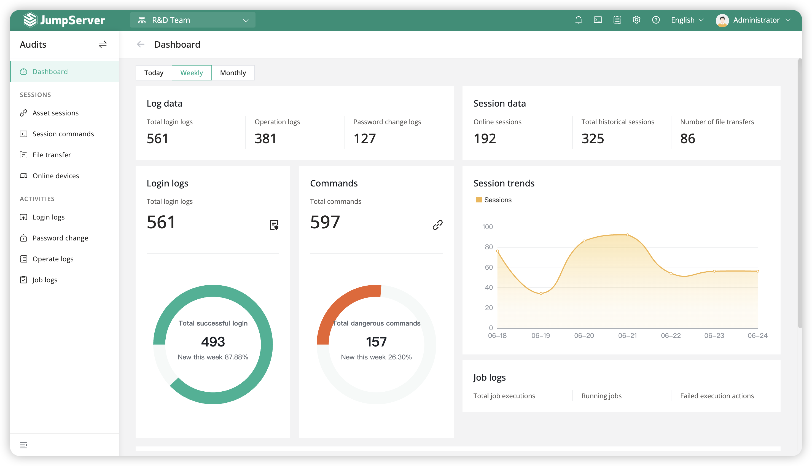

<!-- generated -->

# JumpServer

1-Click installation template for JumpServer on Easypanel

## Description

JumpServer is an open-source, enterprise-grade bastion host and privileged access management (PAM) solution. It provides secure access to servers, databases, and other IT resources through a web-based interface. JumpServer supports multiple authentication methods, session recording, command auditing, and fine-grained access control. It&#39;s designed to help organizations manage and monitor privileged access to critical infrastructure while maintaining security compliance and audit trails.

## Instructions

Login using the default admin credentials; admin/ChangeMe.

## Benefits

- Privileged Access Management: Centralized management of privileged access to servers, databases, and other IT resources with comprehensive audit trails and access controls.
- Session Recording: Complete session recording and playback capabilities for security auditing and compliance requirements.
- Multi-Protocol Support: Support for SSH, RDP, VNC, and other protocols with a unified web-based interface for all connections.
- Enterprise Security: Enterprise-grade security features including MFA, RBAC, and integration with LDAP/AD for user management.

## Features

- Web-Based Interface: Modern, responsive web interface for managing users, assets, and access policies without requiring client software installation.
- Command Auditing: Detailed command auditing and logging for all privileged operations with searchable command history and real-time monitoring.
- Asset Management: Comprehensive asset management for servers, databases, and network devices with automated discovery and inventory capabilities.
- User Management: Flexible user management with support for local users, LDAP/AD integration, and role-based access control (RBAC).
- Session Management: Advanced session management with real-time monitoring, session sharing, and automatic session termination capabilities.
- Compliance & Reporting: Built-in compliance reporting and audit capabilities to meet regulatory requirements and security standards.

## Links

- [GitHub](https://github.com/jumpserver/jumpserver)
- [Documentation](https://docs.jumpserver.org/)
- [Docker Hub](https://hub.docker.com/r/jumpserver/jms_all)
- [Template Source](https://github.com/easypanel-io/templates/tree/main/templates/jumpserver)

## Options

Name | Description | Required | Default Value
-|-|-|-
App Service Name | - | yes | jumpserver
App Service Image | JumpServer Docker image | yes | jumpserver/jms_all:v4.10.12

## Screenshots

## Change Log

- 2025-09-06 – Initial Template Release (v4.10.7)
- 2025-12-25 – Version bumped to v4.10.12

## Contributors

- [Ahson Shaikh](https://github.com/Ahson-Shaikh)
