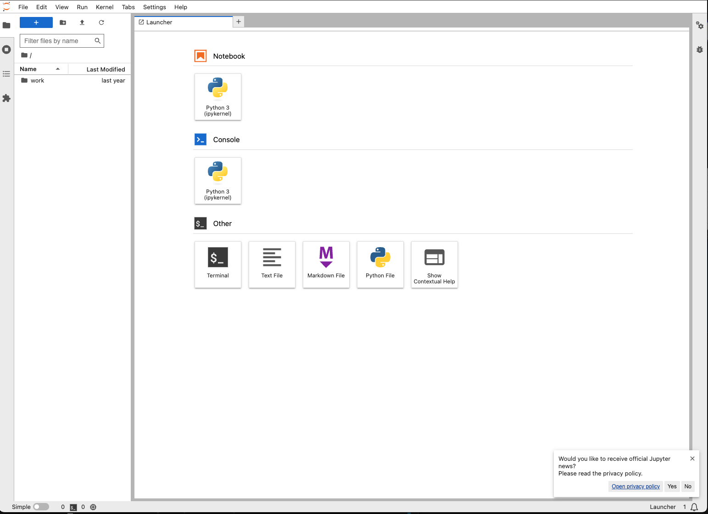

<!-- generated -->

# JupyterNotebook

1-Click installation template for JupyterNotebook on Easypanel

## Description

Jupyter Notebook is a popular, free, and open-source web application that allows you to create and share documents containing live code, equations, visualizations, and narrative text. It supports numerous programming languages and is widely used for data cleaning and transformation, numerical simulation, statistical modeling, data visualization, machine learning, and much more. The app is designed to be accessed via your web browser, providing an interactive interface for easy development and experimentation. It supports hardware acceleration for enhanced performance in computational tasks. The app is compatible with multiple architectures, ensuring it can run on various systems.

## Instructions

Run &quot;jupyter server list&quot; in the console of the service and copy the token. Then either login with the token or create a password using that.

## Benefits

- Interactive Computing: Jupyter Notebook provides an interactive environment where users can write and execute code in real time, view outputs immediately, and iterate quickly.
- Multi-Language Support: Jupyter Notebook supports numerous programming languages through its extensible kernel architecture, including Python, R, Julia, and more.
- Visualizations and Sharing: Create rich visualizations and share notebooks easily with others, promoting collaboration and reproducibility.

## Features

- Open Source: Jupyter Notebook is free and open-source software. This allows users to freely use, modify, and distribute it.
- Web-Based Access: Access the application via your web browser, making it easy to use on any device without additional installations.
- Customizable Environment: Configure the environment to suit your workflow by using a range of optional environment variables and settings.
- Docker Integration: Jupyter Notebook works seamlessly with Docker, enabling rapid deployment and ensuring a consistent development environment.

## Links

- [Documentation](https://jupyter-notebook.readthedocs.io/en/stable/)
- [Github](https://github.com/jupyter/notebook)
- [Template Source](https://github.com/easypanel-io/templates/tree/main/templates/jupyter-notebook)

## Options

Name | Description | Required | Default Value
-|-|-|-
App Service Name | - | yes | jupyternotebook
App Service Image | - | yes | 

## Screenshots

## Change Log

- 2024-01-06 – First release

## Contributors

- [Ahson Shaikh](https://github.com/Ahson-Shaikh)
