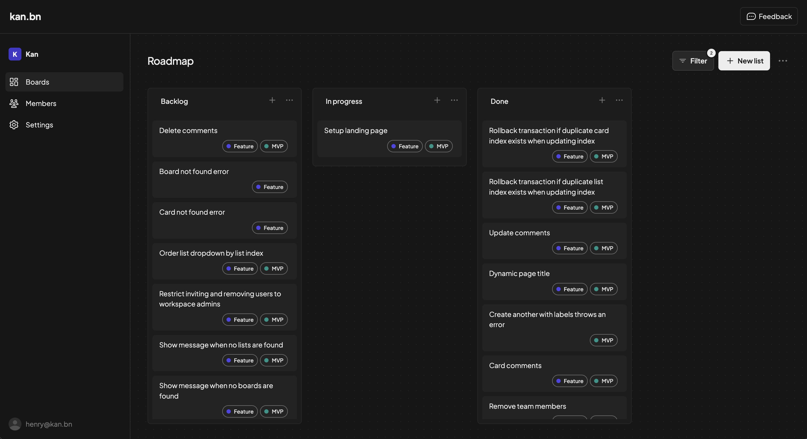

<!-- generated -->

# Kan

1-Click installation template for Kan on Easypanel

## Description

Kan is a self-hosted Kanban app (Trello-style) built with Next.js, tRPC, Better Auth, and PostgreSQL. It supports boards, workspaces, labels, comments, Trello import, and optional email, Redis, S3, and OAuth. The published web container does not apply database migrations on startup; upstream expects a separate migrate image (Drizzle) to run before the web process, matching their Docker Compose stack.

## Instructions

Deploy order matches upstream: Postgres → migrate (kan-migrate, runs
`drizzle-kit migrate` once) → web. If the web app errors on first boot,
wait for the migrate service to finish successfully, then restart the web service.
Secrets: BETTER_AUTH_SECRET is generated for you; keep it stable across
restarts. Auth: With defaults, use sign-up on the login page unless you set
NEXT_PUBLIC_DISABLE_SIGN_UP in env (see docs). Optional: Redis, SMTP, S3, and
OAuth env vars are documented upstream.

## Benefits

- Modern Kanban: Familiar boards, lists, and cards with a clean web UI and team features.
- Self-hosted: Your data stays on your infrastructure with PostgreSQL you control.
- Auth-ready: Email/password via Better Auth; extend with OAuth and OIDC using env vars.

## Features

- Boards & workspaces: Organize work with visibility controls, members, and activity history.
- Imports & metadata: Trello import, labels, filters, comments, and templates.
- Database migrations: Dedicated migrate container aligns with official Docker Compose before web starts.
- Optional integrations: Redis rate limiting, SMTP, S3 uploads, and social login when configured.

## Links

- [Website](https://kan.bn)
- [Documentation](https://docs.kan.bn/)
- [GitHub](https://github.com/kanbn/kan)
- [Container registry (GHCR)](https://github.com/kanbn/kan/pkgs/container/kan)
- [Template Source](https://github.com/easypanel-io/templates/tree/main/templates/kan)

## Options

Name | Description | Required | Default Value
-|-|-|-
App Service Name | - | yes | kan-web
Web Image | Kan web application (Next.js). Pin to the same release family as migrate. | yes | ghcr.io/kanbn/kan:0.5.6
Migrate Image | One-shot Drizzle migrations; must match your web image version. See https://github.com/kanbn/kan/pkgs/container/kan-migrate for tags. | yes | ghcr.io/kanbn/kan-migrate:0.5.6

## Screenshots

## Change Log

- 2025-09-30 – First release
- 2026-03-20 – Website/docs links, setup instructions, kan-migrate service parity, BETTER_AUTH_SECRET via randomBytes, note stateless web (no app volumes)

## Contributors

- [Ahson Shaikh](https://github.com/Ahson-Shaikh)
