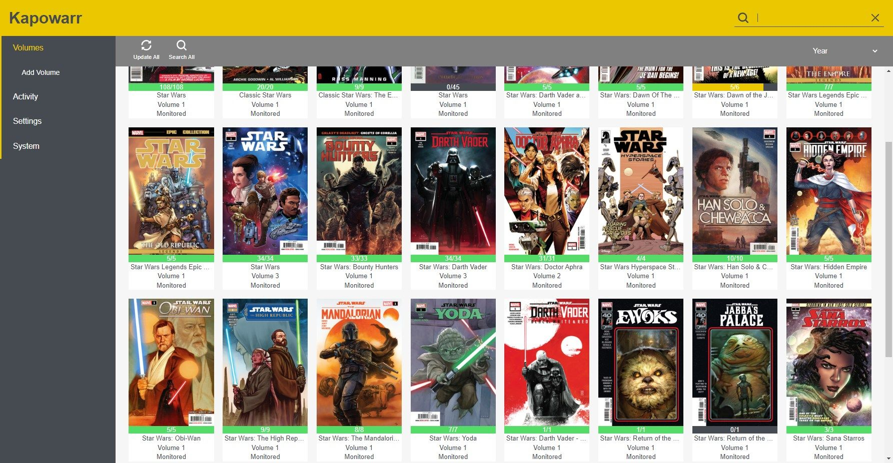

<!-- generated -->

# Kapowarr

1-Click installation template for Kapowarr on Easypanel

## Description

Kapowarr is a comic book management system that helps you organize and manage your digital comic collection. It provides a user-friendly interface for browsing, reading, and managing your comics.

## Instructions

Open Kapowarr on the given domain, then go to settings and confirm your library path points to `/comics-1` and your temporary download path points to `/app/temp_downloads`. Add your series and import existing files into the library, then configure metadata and download preferences from the web UI.

## Benefits

- Comic Book Management: Kapowarr provides a comprehensive solution for managing your digital comic collection with an intuitive interface.
- Easy Organization: Organize your comics with metadata, covers, and series information for a better reading experience.
- User-Friendly: Simple and intuitive interface makes it easy to browse and read your comics.

## Features

- Comic Management: Organize and manage your comic collection with metadata and covers.
- Reading Interface: Built-in comic reader with support for various formats.
- Metadata Support: Automatic metadata fetching and management for your comics.
- Series Organization: Organize comics by series, volumes, and issues.
- Custom Libraries: Create and manage multiple comic libraries.
- Containerized: Easy to deploy and manage in containerized environments.

## Links

- [Github](https://github.com/Casvt/Kapowarr)
- [Documentation](https://casvt.github.io/Kapowarr/)
- [Template Source](https://github.com/easypanel-io/templates/tree/main/templates/kapowarr)

## Options

Name | Description | Required | Default Value
-|-|-|-
App Service Name | - | yes | kapowarr
App Service Image | - | yes | mrcas/kapowarr:v1.3.1

## Screenshots

## Change Log

- 2025-04-29 – First Release
- 2026-05-08 – Version bumped to v1.3.1

## Contributors

- [Ahson Shaikh](https://github.com/Ahson-Shaikh)
