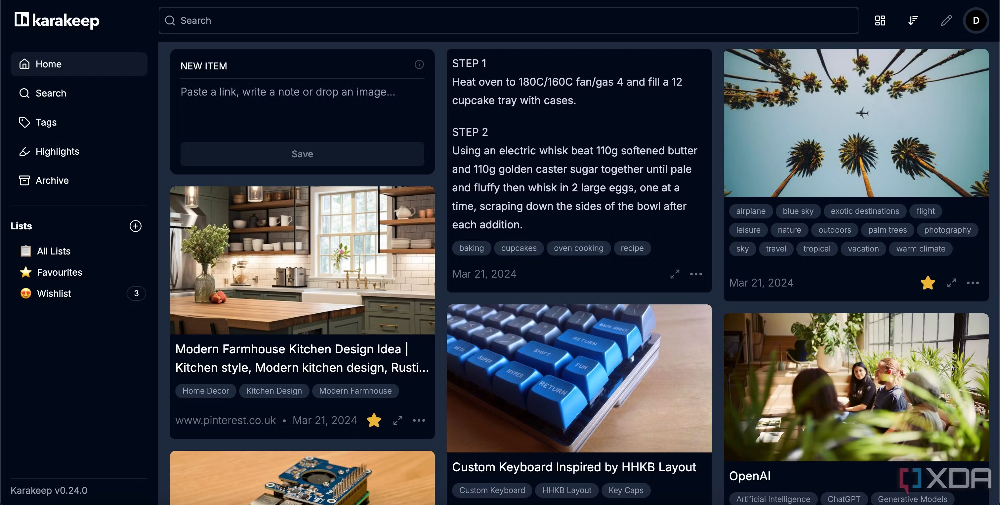

<!-- generated -->

# Karakeep

1-Click installation template for Karakeep on Easypanel

## Description

Knowledge management system that helps you collect, search, and retrieve information efficiently.

## Instructions

Please provide the OpenAI API Key and Sign Up for the user account.

## Benefits

- Efficient Knowledge Management: Easily collect, organize, and retrieve your information in one centralized place.
- Powerful Search: Advanced search capabilities with Meilisearch integration for fast and accurate results.
- Web Scraping Capabilities: Built-in Chrome browser integration for capturing content from the web.

## Features

- Document Management: Store and organize documents, notes, and web content.
- Full-Text Search: Find content quickly with powerful search capabilities.
- Web Scraping: Capture and save content directly from websites.
- OpenAI Integration: Optional AI capabilities with OpenAI API integration.

## Links

- [Website](https://karakeep.app)
- [Documentation](https://docs.karakeep.app)
- [Github](https://github.com/karakeep-app/karakeep)
- [Template Source](https://github.com/easypanel-io/templates/tree/main/templates/karakeep)

## Options

Name | Description | Required | Default Value
-|-|-|-
Service Name | - | yes | karakeep
App Service Image | - | yes | ghcr.io/karakeep-app/karakeep:0.26.0
Chrome Image | - | yes | gcr.io/zenika-hub/alpine-chrome:123
Meilisearch Image | - | yes | getmeili/meilisearch:v1.15.2
OpenAI API Key | - | yes | 

## Screenshots

## Change Log

- 2025-05-26 – First release

## Contributors

- [Ahson Shaikh](https://github.com/Ahson-Shaikh)
