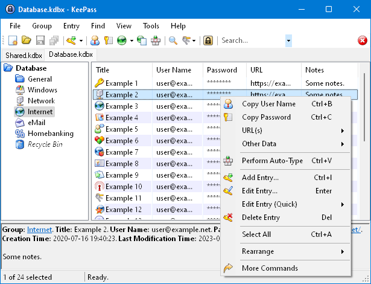

<!-- generated -->

# KeePassXC

1-Click installation template for KeePassXC on Easypanel

## Description

KeePassXC is a modern, secure, and open-source password manager that stores and manages your passwords in an encrypted database. It provides strong security features and cross-platform compatibility.

## Benefits

- Security: Strong encryption and security features
- Cross-Platform: Works on Windows, macOS, and Linux
- Open Source: Transparent and community-driven development
- Password Management: Secure storage and management of passwords

## Features

- Strong Encryption: AES-256 encryption for password databases
- Auto-Type: Automatically fill in passwords
- Password Generator: Create strong, random passwords
- Browser Integration: Integrate with web browsers
- Two-Factor Authentication: Support for 2FA and TOTP

## Links

- [Website](https://keepassxc.org)
- [Documentation](https://keepassxc.org/docs)
- [GitHub](https://github.com/keepassxreboot/keepassxc)
- [Template Source](https://github.com/easypanel-io/templates/tree/main/templates/keepassxc)

## Options

Name | Description | Required | Default Value
-|-|-|-
App Service Name | - | yes | keepassxc
App Service Image | - | yes | lscr.io/linuxserver/keepassxc:2.7.11

## Screenshots

## Change Log

- 2025-04-09 – First Release
- 2026-05-04 – Version bumped to 2.7.11

## Contributors

- [Ahson Shaikh](https://github.com/Ahson-Shaikh)
