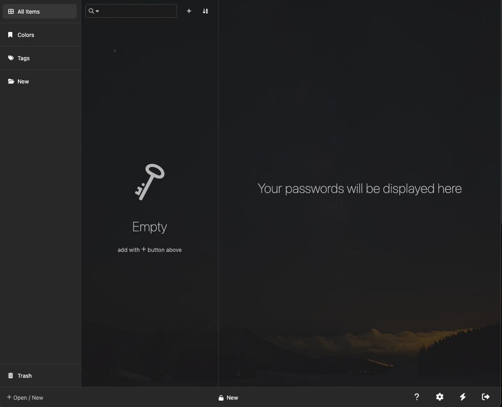

<!-- generated -->

# KeeWeb

1-Click installation template for KeeWeb on Easypanel

## Description

KeeWeb is a modern, fast, and self-hosted password manager designed for individuals and teams. It provides a sleek, responsive user interface for managing and securing your passwords efficiently. KeeWeb supports importing and syncing password databases from various sources such as Dropbox, OneDrive, or local storage. It offers seamless offline access, powerful search capabilities, and advanced encryption to protect your sensitive data. KeeWeb ensures a consistent experience across desktop and web applications, with customization options to suit your preferences.

## Benefits

- Secure Password Management: KeeWeb offers end-to-end encryption to ensure that your passwords and sensitive data remain safe and secure, whether stored locally or in the cloud.
- Cross-Platform Compatibility: KeeWeb provides a consistent experience across web and desktop applications, allowing you to manage your passwords seamlessly on any device.
- Easy Database Syncing: KeeWeb supports synchronization with popular cloud storage services like Dropbox and OneDrive, ensuring your password database is always up-to-date.

## Features

- Powerful Search Functionality: KeeWeb includes a robust search feature to quickly locate and manage your saved passwords, making it efficient to access the information you need.
- Offline Access: KeeWeb allows you to access and manage your password database offline, providing uninterrupted service even without an internet connection.
- Customizable User Interface: KeeWeb offers a fully customizable interface, allowing users to tweak themes, layouts, and display preferences to match their needs.
- Advanced Security Features: KeeWeb includes advanced security settings like auto-lock, database keyfile support, and integration with hardware security keys for enhanced protection.

## Links

- [Website](https://keeweb.info/)
- [Documentation](https://github.com/keeweb/keeweb/wiki)
- [Github](https://github.com/keeweb/keeweb)
- [Template Source](https://github.com/easypanel-io/templates/tree/main/templates/keeweb)

## Options

Name | Description | Required | Default Value
-|-|-|-
App Service Name | - | yes | keeweb
App Service Image | - | yes | ghcr.io/keeweb/keeweb:latest

## Screenshots

## Change Log

- 2024-01-07 – First Release

## Contributors

- [Ahson Shaikh](https://github.com/Ahson-Shaikh)
