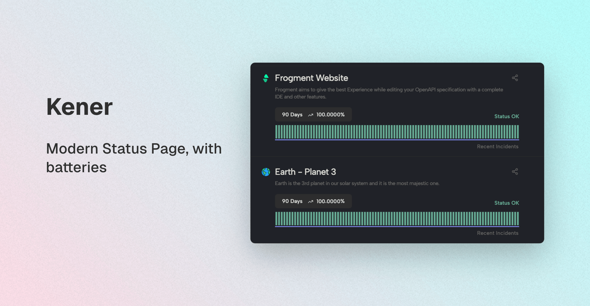

<!-- generated -->

# Kener

1-Click installation template for Kener on Easypanel

## Description

Kener is an advanced, self-hosted status page system designed for individuals and teams. It offers a sleek, responsive user interface for monitoring and communicating the status of your services efficiently. Kener supports real-time monitoring, incident management, and customizable status pages. With seamless offline access, powerful search capabilities, and robust encryption, Kener ensures your service status is transparent and secure. It provides a consistent experience across desktop and web applications, with customization options to suit your preferences.

## Benefits

- Real-Time Service Monitoring: Kener provides real-time monitoring of your services, allowing you to track uptime and performance metrics effectively.
- Incident Management: Manage incidents efficiently with Kener's integrated incident reporting and tracking features, ensuring timely communication with your users.
- Customizable Status Pages: Create and customize status pages that reflect your brand, providing transparency and building trust with your audience.

## Features

- Seamless Offline Access: Access and manage your status pages offline, ensuring uninterrupted service even without an internet connection.
- Powerful Search Functionality: Quickly locate and manage your monitors and incidents with Kener's robust search capabilities.
- Advanced Security Features: Protect your data with advanced security settings, including end-to-end encryption and access controls.
- Integration with GitHub: Leverage GitHub integration for incident management, enabling collaborative issue tracking and resolution.

## Links

- [Website](https://kener.ing/)
- [Documentation](https://kener.ing/docs)
- [GitHub](https://github.com/rajnandan1/kener)
- [Template Source](https://github.com/easypanel-io/templates/tree/main/templates/kener)

## Options

Name | Description | Required | Default Value
-|-|-|-
App Service Name | - | yes | kener
App Service Image | - | yes | ghcr.io/rajnandan1/kener:3.0.1

## Screenshots

## Change Log

- 2025-01-16 – First Release

## Contributors

- [Ahson Shaikh](https://github.com/Ahson-Shaikh)
