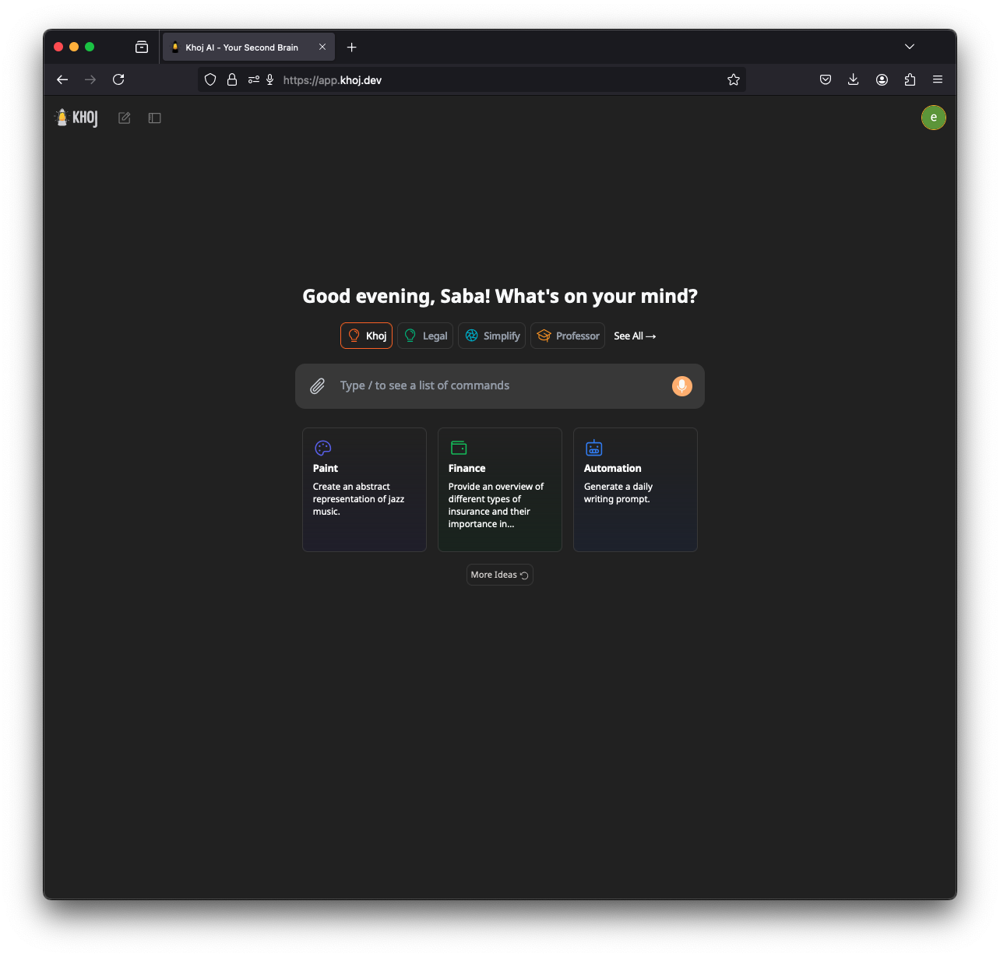

<!-- generated -->

# Khoj

1-Click installation template for Khoj on Easypanel

## Description

Khoj is an AI-powered personal search and chat application that helps you find and organize your personal knowledge. It supports various AI models, web search integration, and code execution capabilities.

## Instructions

Configure your chat model provider and search api providers with khoj environment variables.

## Benefits

- Personal Search: Search through your personal knowledge and documents
- AI-Powered: Get intelligent answers and insights from your data
- Code Execution: Run code in a secure sandbox environment
- Web Search Integration: Combine personal and web search results
- Self-Hosted: Keep your data private and secure

## Features

- Document Search: Search through your personal documents and notes
- AI Chat: Chat with AI about your personal knowledge
- Code Sandbox: Run code in a secure environment
- Web Search: Search the web with privacy
- Multi-Model Support: Use various AI models for different tasks
- Admin Interface: Manage your Khoj instance

## Links

- [Website](https://khoj.dev)
- [Documentation](https://docs.khoj.dev)
- [GitHub](https://github.com/khoj-ai/khoj)
- [Template Source](https://github.com/easypanel-io/templates/tree/main/templates/khoj)

## Options

Name | Description | Required | Default Value
-|-|-|-
App Service Name | - | yes | khoj
App Service Image | - | yes | ghcr.io/khoj-ai/khoj:1.42.9
Database Image | - | yes | pgvector/pgvector:0.8.1-pg15
Sandbox Image | - | yes | ghcr.io/khoj-ai/terrarium:latest
SearxNG Image | - | yes | searxng/searxng:2025.4.12-391bb1268
Admin Email | - | yes | username@example.com
Admin Password | Auto-generated if not provided. | no | 
OpenAI API Key | - | no | 
Gemini API Key | - | no | 
Anthropic API Key | - | no | 
OpenAI Base URL | - | no | 
Jina API Key | - | no | 
Serper Dev API Key | - | no | 
Firecrawl API Key | - | no | 
OloStep API Key | - | no | 

## Screenshots

## Change Log

- 2025-04-14 – First Release

## Contributors

- [Ahson Shaikh](https://github.com/Ahson-Shaikh)
