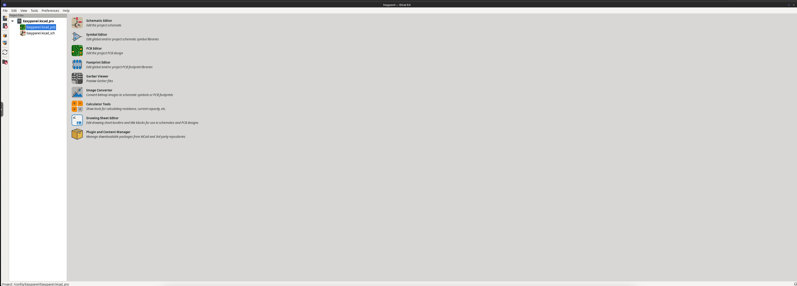

<!-- generated -->

# KiCad

1-Click installation template for KiCad on Easypanel

## Description

KiCad is an open-source software suite for electronic design automation (EDA), enabling the design and simulation of electronic circuits and printed circuit boards (PCBs). It provides a comprehensive set of tools for schematic capture, PCB layout, and 3D visualization. KiCad supports extensive libraries of components and footprints, allowing designers to create custom designs with ease. Its robust features, such as design rule checking, netlist generation, and Gerber export, make it a preferred choice for professionals and hobbyists alike. With a focus on flexibility and open-source principles, KiCad empowers users to bring their electronic design projects to life.

## Benefits

- Comprehensive EDA Suite: KiCad provides a complete set of tools for electronic design, from schematic capture to PCB layout and 3D visualization, simplifying the design process.
- Open-Source and Flexible: As an open-source tool, KiCad is free to use and customize, making it accessible for both professionals and hobbyists.
- Extensive Component Libraries: KiCad includes an extensive library of components and footprints, with the ability to create and manage custom libraries for specific projects.
- Professional-Grade Tools: Features like design rule checking, netlist generation, and Gerber file export ensure that KiCad meets professional standards.
- Community-Driven Development: KiCad benefits from a vibrant community of developers and users who contribute to its ongoing improvement and provide valuable resources.

## Features

- Schematic Capture: KiCad's schematic editor allows users to create and manage electronic circuit diagrams with ease, including hierarchical designs.
- PCB Layout: The PCB layout editor provides powerful tools for designing multi-layer boards, routing, and managing design rules.
- 3D Visualization: KiCad includes a 3D viewer that allows designers to visualize their PCB designs with realistic rendering of components and boards.
- Design Rule Checking: The design rule checker ensures that layouts meet predefined constraints, helping to prevent errors during manufacturing.
- Gerber File Export: KiCad supports Gerber file export for seamless collaboration with PCB manufacturers.
- Component Libraries: Extensive libraries of components and footprints are included, with support for creating custom libraries.
- Community Support: KiCad's active community provides tutorials, documentation, and forums for users of all skill levels.

## Links

- [Website](https://www.kicad.org)
- [Documentation](https://docs.kicad.org)
- [Github](https://github.com/KiCad/kicad-source-mirror)
- [Template Source](https://github.com/easypanel-io/templates/tree/main/templates/kicad)

## Options

Name | Description | Required | Default Value
-|-|-|-
App Service Name | - | yes | kicad
App Service Image | - | yes | linuxserver/kicad:8.0.7

## Screenshots

## Change Log

- 2024-12-27 – First Release

## Contributors

- [Ahson Shaikh](https://github.com/Ahson-Shaikh)
