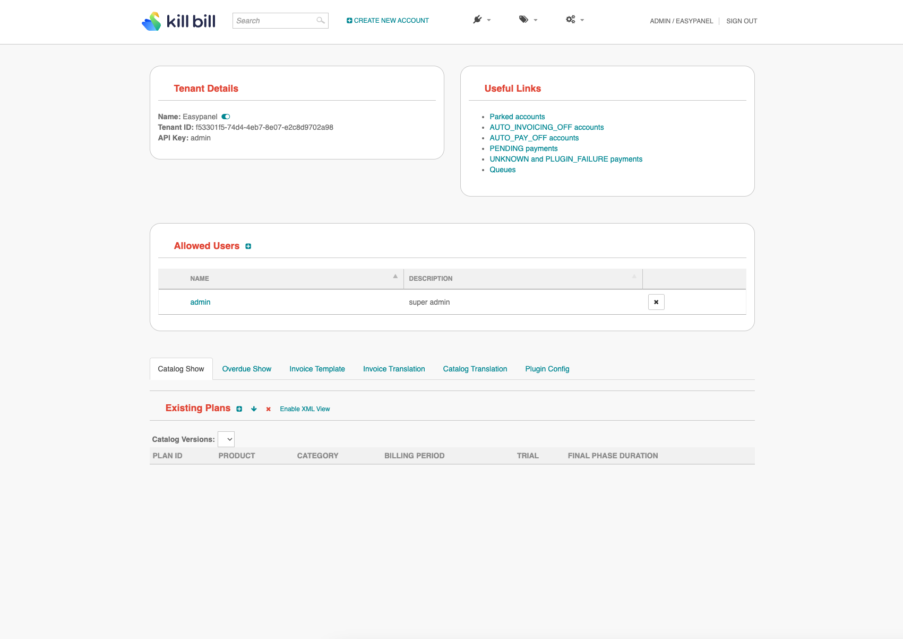

<!-- generated -->

# KillBill

1-Click installation template for KillBill on Easypanel

## Description

KillBill is an open-source subscription billing and payment platform designed to simplify complex billing workflows for SaaS and other businesses. It provides robust support for recurring billing, invoicing, and payment management while offering flexibility for customization. KillBill ensures seamless integration with third-party payment gateways, making it adaptable for global payment needs. It supports multiple plugins to extend functionality, enabling businesses to manage tax compliance, analytics, notifications, and more. The platform&#39;s Kaui UI offers an intuitive administrative console for managing subscriptions, invoices, payments, and tenants. KillBill&#39;s API-driven design allows developers to customize and automate every aspect of the billing process. Its modular architecture ensures it can scale with the growing needs of businesses, providing robust tools for revenue management.

## Instructions

You have to configure the KillBill URL in your Kaui Environment Section. Then access the Kaui App Service to access KillBill. Default credentials username; admin, password; password.

## Benefits

- Flexible Billing Engine: KillBill supports complex billing scenarios, including recurring payments, subscription management, and multi-tier pricing models.
- Seamless Payment Integration: KillBill integrates with various third-party payment gateways, supporting global payment methods for businesses of any size.
- API-Driven: KillBill provides a powerful API-first approach, enabling developers to automate and customize billing workflows to suit business needs.
- Extensible Plugin System: The plugin architecture allows extending KillBill's capabilities with custom integrations, notifications, tax calculations, and reporting.
- Centralized Admin Management: Kaui, the admin console, allows centralized management of subscriptions, invoices, payments, and tenants, providing clear insights into billing operations.

## Features

- Subscription Management: Create, update, and manage subscriptions with ease, supporting various pricing models such as flat, tiered, and volume-based billing.
- Invoicing Engine: KillBill automatically generates detailed invoices for subscriptions and usage-based charges, ensuring accuracy and compliance.
- Payment Management: Manage payments, refunds, and chargebacks with integrations to major payment gateways like Stripe, PayPal, and Authorize.Net.
- Multi-Tenancy: KillBill supports multi-tenancy, enabling businesses to manage multiple customers under a single instance.
- Extensible Plugin Framework: Extend KillBill's capabilities using plugins for tax calculations, analytics, notifications, or custom payment integrations.
- API-First Design: The powerful REST API allows you to programmatically interact with all aspects of billing, invoicing, and payment management.
- Kaui Admin Console: Kaui provides an intuitive user interface to manage subscriptions, payments, invoices, and tenants efficiently.
- Event Notifications: Leverage KillBill's event-driven architecture to trigger notifications, updates, or actions based on billing events.

## Links

- [Website](https://killbill.io)
- [Documentation](https://docs.killbill.io)
- [GitHub](https://github.com/killbill/killbill)
- [Template Source](https://github.com/easypanel-io/templates/tree/main/templates/killbill)

## Options

Name | Description | Required | Default Value
-|-|-|-
App Service Name | - | yes | killbill
KillBill Service Image | - | yes | killbill/killbill:0.24.10
Kaui Admin Console Image | - | yes | killbill/kaui:3.0.9

## Screenshots

## Change Log

- 2023-3-16 – First release

## Contributors

- [Ahson Shaikh](https://github.com/Ahson-Shaikh)
