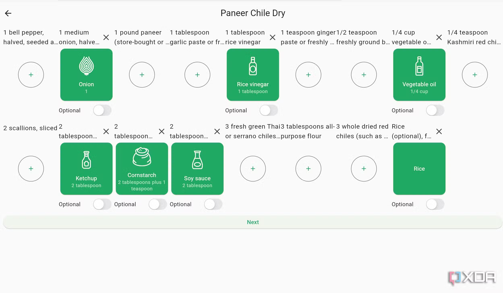

<!-- generated -->

# KitchenOwl

1-Click installation template for KitchenOwl on Easypanel

## Description

KitchenOwl is a self-hosted grocery list and recipe manager designed to help you organize your kitchen and meal planning. It provides a clean web interface for managing shopping lists, recipes, and inventory. Perfect for families and individuals who want to streamline their grocery shopping and meal preparation.

## Benefits

- Grocery List Management: Create and manage shopping lists with categories, quantities, and automatic suggestions based on your recipes.
- Recipe Organization: Store and organize your favorite recipes with ingredients, instructions, and nutritional information.
- Meal Planning: Plan your meals and automatically generate shopping lists based on your planned recipes.
- Family Collaboration: Share lists and recipes with family members for collaborative meal planning and shopping.

## Features

- Web Interface: Clean, responsive web interface accessible from any device.
- Shopping Lists: Create categorized shopping lists with quantities and check-off functionality.
- Recipe Management: Store recipes with ingredients, instructions, cooking times, and nutritional information.
- Inventory Tracking: Track your pantry inventory and get suggestions for what to cook.
- Meal Planning: Plan meals for the week and automatically generate shopping lists.
- Data Persistence: All data is stored locally and persists across container restarts.
- JWT Authentication: Secure authentication system for protecting your data.

## Links

- [Website](https://kitchenowl.org/)
- [GitHub](https://github.com/Tombursch/kitchenowl)
- [Documentation](https://docs.kitchenowl.org/latest/)
- [DockerHub Frontend](https://hub.docker.com/r/tombursch/kitchenowl-web)
- [DockerHub Backend](https://hub.docker.com/r/tombursch/kitchenowl-backend)
- [Template Source](https://github.com/easypanel-io/templates/tree/main/templates/kitchenowl)

## Options

Name | Description | Required | Default Value
-|-|-|-
App Service Name | - | yes | kitchenowl
Frontend Image | - | yes | tombursch/kitchenowl-web:v0.7.4
Backend Image | - | yes | tombursch/kitchenowl-backend:v0.7.4

## Screenshots

## Change Log

- 2025-09-25 – First release (v0.7.4)

## Contributors

- [Ahson Shaikh](https://github.com/Ahson-Shaikh)
