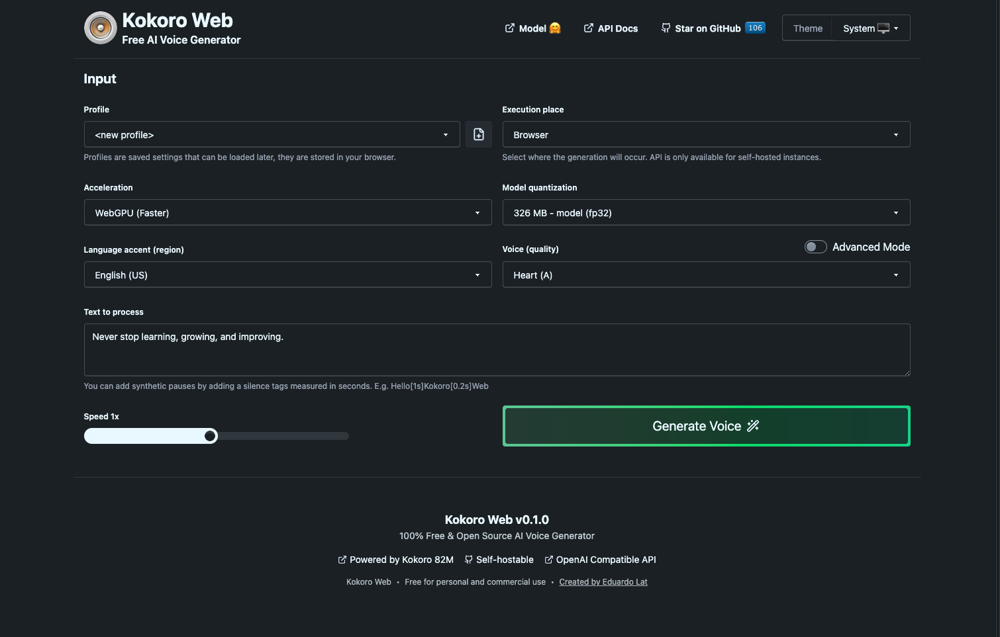

<!-- generated -->

# Kokoro

1-Click installation template for Kokoro on Easypanel

## Description

Kokoro is a powerful, browser-based AI voice generator that lets you create natural-sounding voices without installing anything. Use it directly in your browser or self-host it for your own applications with OpenAI API compatibility!

## Benefits

- No Installation Required: Generate high-quality, natural-sounding voices directly in your browser without the need for any installations.
- Self-hostable and Flexible: Use Kokoro in your own applications by self-hosting it, ensuring full control over your voice generation capabilities with OpenAI API compatibility.
- Cutting-edge AI Voice Technology: Leverage advanced AI models to create lifelike voice outputs that are perfect for multimedia projects, virtual assistants, and more.

## Features

- Browser-based Interface: A user-friendly, web-based interface that allows you to generate voices seamlessly from any modern browser.
- OpenAI API Compatibility: Integrates with the OpenAI API for easy access to state-of-the-art voice generation models.
- Customizable Voice Options: Fine-tune voice characteristics such as tone, pitch, and speed to match your specific requirements.
- Self-hosting Capability: Deploy Kokoro on your own servers to maintain control over your data and voice generation processes.

## Links

- [Github](https://github.com/eduardolat/kokoro-web)
- [Template Source](https://github.com/easypanel-io/templates/tree/main/templates/kokoro)

## Options

Name | Description | Required | Default Value
-|-|-|-
App Service Name | - | yes | kokoro
App Service Image | - | yes | ghcr.io/eduardolat/kokoro-web:0.1.0

## Screenshots

## Change Log

- 2025-03-05 – First Release (0.1.0)

## Contributors

- [Ahson-Shaikh](https://github.com/Ahson-Shaikh)
