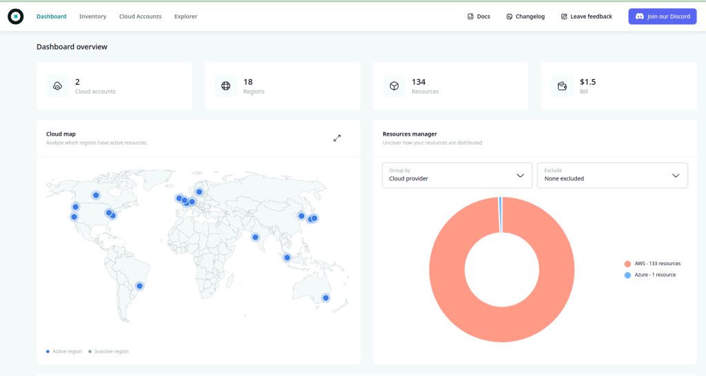

<!-- generated -->

# Komiser

1-Click installation template for Komiser on Easypanel

## Description

Komiser is an open-source cloud resource manager that helps you understand, manage, and optimize your cloud infrastructure costs. It provides a unified dashboard to monitor and manage resources across multiple cloud providers, offering insights into resource usage, cost optimization opportunities, and security best practices.

## Instructions

Once deployed, please provide your credentials in the credentials.yaml file, and then restart the service.

## Benefits

- Cloud Cost Optimization: Identify and optimize cloud resource costs across providers.
- Multi-Cloud Management: Unified dashboard for managing multiple cloud providers.
- Resource Monitoring: Real-time monitoring of cloud resources and usage.
- Security Insights: Security best practices and compliance monitoring.

## Features

- Cost Analysis: Detailed cost breakdown and optimization recommendations.
- Resource Tracking: Track and manage cloud resources across providers.
- Security Monitoring: Monitor security configurations and compliance.
- Customizable Dashboard: Customizable views and reporting options.

## Links

- [Website](https://komiser.io/)
- [Documentation](https://docs.komiser.io/)
- [GitHub](https://github.com/tailwarden/komiser)
- [Template Source](https://github.com/easypanel-io/templates/tree/main/templates/komiser)

## Options

Name | Description | Required | Default Value
-|-|-|-
App Service Name | - | yes | komiser
Komiser Image | - | yes | tailwarden/komiser:3.0.0

## Screenshots

## Change Log

- 2025-03-26 – Initial template release

## Contributors

- [Ahson Shaikh](https://github.com/Ahson-Shaikh)
