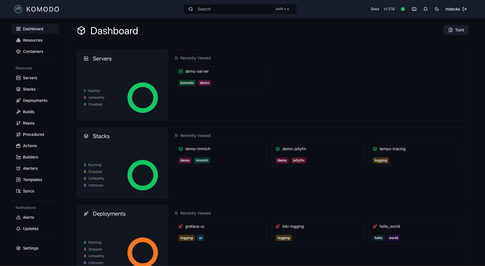

<!-- generated -->

# Komodo

1-Click installation template for Komodo on Easypanel

## Description

Komodo is a comprehensive server management platform that provides monitoring and control capabilities for Docker containers and system processes. It offers a unified dashboard to manage your infrastructure, with features including container management, process monitoring, resource tracking, and system metrics visualization.

## Benefits

- Server Management: Comprehensive platform for monitoring and managing Docker containers and system processes.
- Docker Integration: Deep integration with Docker for container management and monitoring.
- System Monitoring: Monitor system processes, resources, and performance metrics.
- Automation: Automate server tasks and container management workflows.

## Features

- MongoDB Database: Reliable MongoDB database for storing configuration and monitoring data.
- Komodo Core: Main application providing web interface and core functionality.
- Komodo Periphery: Agent for Docker integration and system process monitoring.
- Docker Socket Access: Direct access to Docker socket for container management.
- Process Monitoring: Monitor system processes outside of containers.
- Backup System: Automated database backups with configurable storage paths.
- Web Interface: Clean web interface for server management and monitoring.

## Links

- [Website](https://komo.do)
- [GitHub](https://github.com/moghtech/komodo)
- [Documentation](https://komo.do/docs/intro)
- [Template Source](https://github.com/easypanel-io/templates/tree/main/templates/komodo)

## Options

Name | Description | Required | Default Value
-|-|-|-
App Service Name | - | yes | komodo
Komodo Core Image | - | yes | ghcr.io/moghtech/komodo-core:1.19.4
Komodo Periphery Image | - | yes | ghcr.io/moghtech/komodo-periphery:1.19.4
Admin Username | - | yes | admin
Admin Password | - | yes | changeme

## Screenshots

## Change Log

- 2025-08-25 – First release

## Contributors

- [Ahson Shaikh](https://github.com/Ahson-Shaikh)
