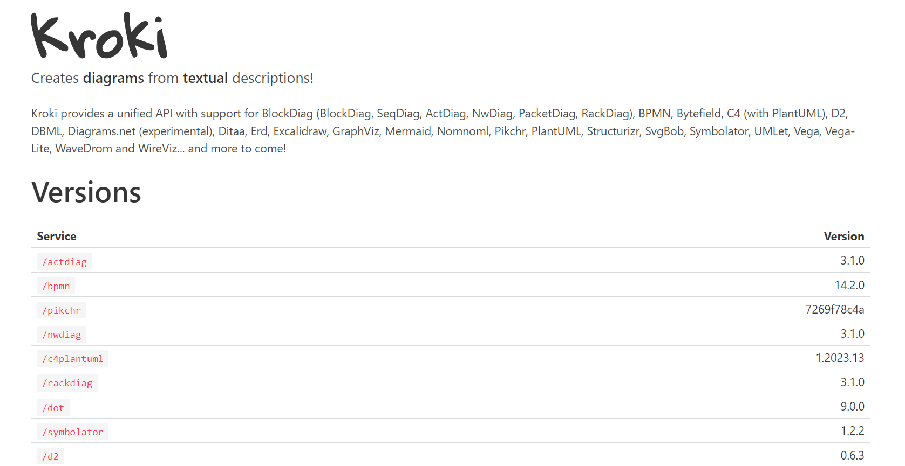

<!-- generated -->

# Kroki

1-Click installation template for Kroki on Easypanel

## Description

Kroki is a self-hosted diagramming and visualization service that allows users to generate diagrams from textual descriptions. It supports multiple diagramming formats, including Mermaid, BPMN, Excalidraw, PlantUML, Graphviz, and more. With Kroki, users can convert structured text into graphical representations quickly and efficiently. The application provides a simple API, making it easy to integrate with other tools. It is lightweight, supports multiple diagram rendering engines, and ensures full control over your data with a self-hosted deployment.

## Benefits

- Versatile Diagram Generation: Kroki supports various diagram formats, including UML, BPMN, Graphviz, Mermaid, and more, allowing users to create diverse visual representations.
- API-Based Integration: With its powerful API, Kroki enables seamless integration with documentation tools, wikis, and other platforms for automated diagram generation.
- Self-Hosted & Secure: Deploy Kroki on your own infrastructure to maintain full control over your data and ensure privacy.

## Features

- Multi-Format Support: Kroki allows users to generate diagrams using multiple text-based languages, including PlantUML, Graphviz, Mermaid, and Excalidraw.
- Lightweight & Efficient: Kroki is optimized for fast rendering, ensuring quick processing of diagram requests.
- Open-Source & Extensible: The platform is open-source, allowing customization and enhancements through additional rendering engines.
- No External Dependencies: Kroki does not require external services or connections, making it ideal for offline or secure environments.

## Links

- [Documentation](https://kroki.io/#docs)
- [Github](https://github.com/yuzutech/kroki)
- [Template Source](https://github.com/easypanel-io/templates/tree/main/templates/kroki)

## Options

Name | Description | Required | Default Value
-|-|-|-
App Service Name | - | yes | kroki
App Service Image | - | yes | yuzutech/kroki
Mermaid Service Image | - | yes | yuzutech/kroki-mermaid
BPMN Service Image | - | yes | yuzutech/kroki-bpmn
Excalidraw Service Image | - | yes | yuzutech/kroki-excalidraw

## Screenshots

## Change Log

- 2025-02-27 – Template Release

## Contributors

- [Ahson Shaikh](https://github.com/Ahson-Shaikh)
