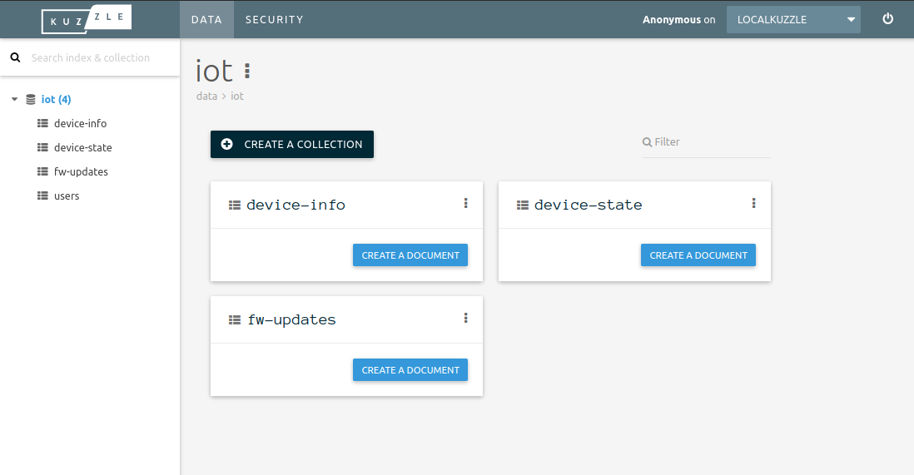

<!-- generated -->

# Kuzzle

1-Click installation template for Kuzzle on Easypanel

## Description

Kuzzle is a free and open-source backend platform designed to accelerate the development of web, mobile, and Internet of Things (IoT) applications. It provides real-time features, multi-protocol API support, and robust user management, enabling developers to focus on building high-level business functionalities. Kuzzle is fully customizable through plugins and offers client SDKs for seamless integration with various platforms. Its flexibility and scalability make it an ideal choice for IoT, geolocation, and enterprise applications.

## Instructions

You should connect with the Kuzzle instance using the provided domain which proxying back to the HTTP/WebSocket connection.

## Benefits

- Real-Time Data Synchronization: Kuzzle provides real-time synchronization for connected clients, enabling seamless updates and interactions in your applications.
- Multi-Protocol Support: Supports HTTP, WebSocket, and MQTT protocols, making it versatile for various application types, including IoT and enterprise systems.
- Open Source & Extensible: Kuzzle is fully open source and extensible, allowing developers to create custom plugins and adapt it to their unique requirements.

## Features

- Real-Time Engine: Kuzzle offers real-time notifications and publish/subscribe mechanisms to ensure immediate updates for your applications.
- User Management: Robust user authentication, authorization, and role management for secure and scalable applications.
- Data Storage: Kuzzle uses Elasticsearch for efficient and scalable data storage with powerful query capabilities.
- Extensibility: Easily extend Kuzzle's functionality through plugins to fit your business needs.
- SDKs and API: Client SDKs for multiple platforms and a multi-protocol API make integration straightforward.

## Links

- [Website](https://kuzzle.io/)
- [Documentation](https://docs.kuzzle.io/)
- [Github](https://github.com/kuzzleio/kuzzle)
- [Template Source](https://github.com/easypanel-io/templates/tree/main/templates/kuzzle)

## Options

Name | Description | Required | Default Value
-|-|-|-
App Service Name | - | yes | kuzzle
App Service Image | - | yes | kuzzleio/kuzzle:2
Elastic Service Image | - | yes | kuzzleio/elasticsearch:7.4.0

## Screenshots

## Change Log

- 2024-11-16 – First Release

## Contributors

- [Ahson Shaikh](https://github.com/Ahson-Shaikh)
