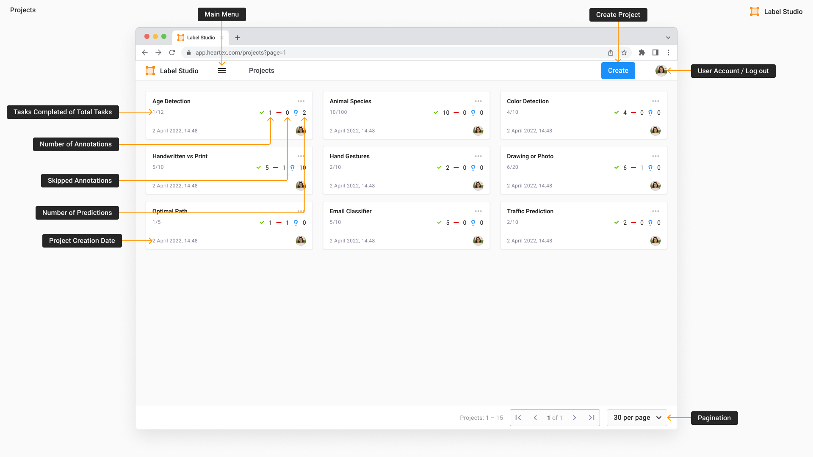

<!-- generated -->

# Label Studio

1-Click installation template for Label Studio on Easypanel

## Description

Label Studio is an open source data labeling tool. It lets you label data types like audio, text, images, videos, and time series with a simple and straightforward UI and export to various model formats. It can be used to prepare raw data or improve existing training data to get more accurate ML models.

## Benefits

- Effortless Data Labeling: Label Studio provides an effortless way to label and annotate data for machine learning models. It allows users to easily create, manage, and configure labeling projects, making it an ideal tool for those who want to experiment with different data types and labeling workflows.
- Easy Project Setup: With Label Studio, setting up annotation projects is a breeze. Users can define custom labeling interfaces and quickly start annotating their data. This makes it easy to visualize, organize, and manage labeled datasets.
- Flexible Deployment: Label Studio offers flexible deployment options. It can be deployed locally, on-premises, or in the cloud, giving users the freedom to choose the deployment strategy that best suits their data security and infrastructure requirements.

## Features

- Command Line Interface: Label Studio provides a command-line interface for easy management and configuration. It offers a variety of options for project setup, data import, and server configuration, including the host, port, and storage settings.
- Multi-Format Support: Label Studio supports multiple data types, including text, images, audio, video, and time series data. This makes it a versatile tool for labeling diverse datasets across different machine learning tasks.
- Exporting Annotations: Once the annotations are complete, they can be exported in multiple formats such as JSON, CSV, and COCO. This makes it easy to integrate labeled data into machine learning workflows.

## Links

- [Website](https://labelstud.io/)
- [Documentation](https://labelstud.io/guide/)
- [Github](https://github.com/HumanSignal/label-studio/)
- [Template Source](https://github.com/easypanel-io/templates/tree/main/templates/labelstudio)

## Options

Name | Description | Required | Default Value
-|-|-|-
Email | - | yes | admin@example.com
Password | - | yes | password
App Service Name | - | yes | labelstudio
App Service Image | - | yes | heartexlabs/label-studio:20250722.133548-develop-cc90fa143

## Screenshots

## Change Log

- 2025-02-14 – First Release

## Contributors

- [Ahson Shaikh](https://github.com/Ahson-Shaikh)
