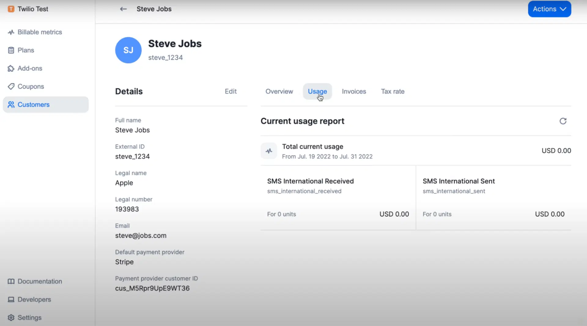

<!-- generated -->

# Lago

1-Click installation template for Lago on Easypanel

## Description

Lago is an open-source metered billing and usage-based pricing platform that helps businesses implement complex pricing models with precision and transparency. Built for modern SaaS companies, Lago provides real-time usage tracking, flexible pricing configurations, automated invoicing, and comprehensive billing analytics. Perfect for businesses that need to implement usage-based pricing, hybrid pricing models, or complex billing scenarios with features like prepaid credits, graduated pricing, and multi-dimensional metering.

## Instructions

You have to generate a RSA private key &quot;openssl genrsa 2048 | base64&quot; and provide it to the service, otherwise the service will not work. You can contact Easypanel support if you need help.

## Benefits

- Usage-Based Billing: Implement complex metered billing models with real-time usage tracking and flexible pricing configurations.
- Automated Invoicing: Generate and send invoices automatically based on usage data with customizable billing cycles and payment terms.
- Developer-Friendly APIs: Comprehensive REST APIs and webhooks for seamless integration with existing systems and applications.

## Features

- Real-Time Usage Tracking: Track customer usage in real-time with high-throughput event ingestion and processing capabilities.
- Flexible Pricing Models: Support for graduated pricing, package pricing, percentage-based pricing, and complex hybrid models.
- Automated Billing Engine: Automated invoice generation, payment processing, and dunning management with configurable billing cycles.
- Customer Management: Comprehensive customer portal with usage analytics, invoice history, and subscription management.
- Analytics & Reporting: Detailed analytics dashboard with revenue tracking, usage patterns, and business intelligence insights.
- Multi-Currency Support: Support for multiple currencies with automatic currency conversion and localized pricing.
- API & Webhooks: RESTful APIs for all operations and webhooks for real-time event notifications and integrations.
- Prepaid Credits: Wallet system for prepaid credits with automatic top-ups and usage deduction capabilities.

## Links

- [Github](https://github.com/getlago/lago)
- [Website](https://getlago.com)
- [Documentation](https://docs.getlago.com)
- [Template Source](https://github.com/easypanel-io/templates/tree/main/templates/lago)

## Options

Name | Description | Required | Default Value
-|-|-|-
App Service Name | - | yes | lago
Backend Service Image | - | yes | getlago/api:v1.31.0
Frontend Service Image | - | yes | getlago/front:v1.31.0
PDF Service Image | - | yes | getlago/lago-gotenberg:7.8.2
RSA Private Key | - | yes | 

## Screenshots

## Change Log

- 2025-07-04 – Initial release

## Contributors

- [Ahson Shaikh](https://github.com/Ahson-Shaikh)
