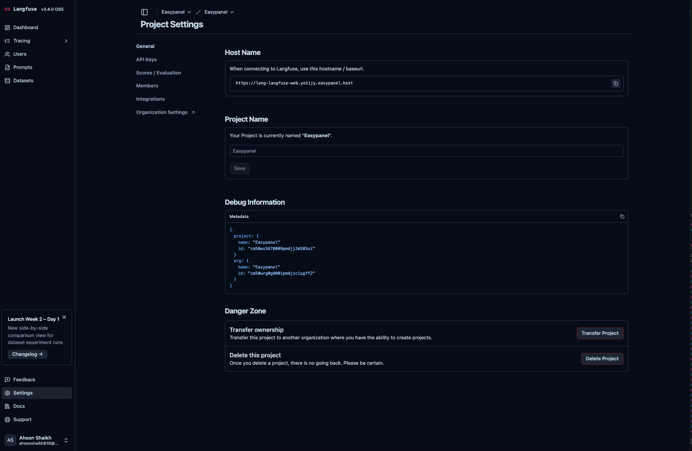
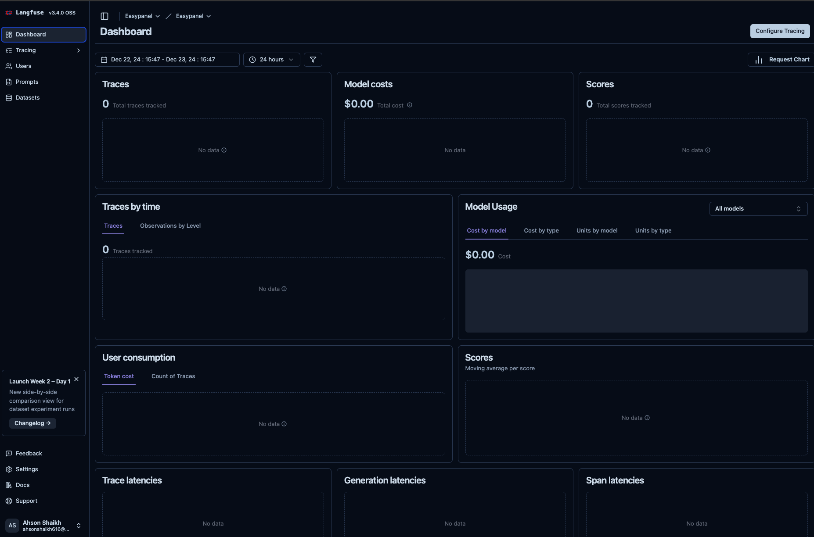

<!-- generated -->

# Langfuse

1-Click installation template for Langfuse on Easypanel

## Description

Langfuse is a powerful, self-hosted observability platform designed for AI applications. It simplifies monitoring, debugging, and optimizing your AI workflows with detailed insights, customizable metrics, and flexible integrations. Langfuse provides a clean and intuitive interface, robust API access, and plugin support to extend its functionality. It ensures privacy and compliance by allowing you to maintain full control over your data with a self-hosted solution. The application is accessible via your host and supports multi-platform awareness, ensuring compatibility with various architectures.

## Benefits

- Streamlined Observability for AI Applications: Langfuse simplifies observability by providing an intuitive way to monitor, analyze, and optimize your AI application workflows.
- Self-Hosted Flexibility: Maintain full control over your data and operations with a self-hosted setup that ensures privacy and compliance.
- Enhanced Debugging: Quickly identify and resolve issues with detailed logs, traces, and metrics tailored for AI-driven systems.

## Features

- Powerful API Access: Seamlessly integrate Langfuse into your workflows using its robust API for efficient data ingestion and analysis.
- Built-In Analytics: Gain actionable insights with comprehensive analytics, including performance metrics, user interactions, and bottleneck identification.
- Plugin Support: Enhance Langfuse’s capabilities with plugins to adapt it to your specific use case.
- Customizable Monitoring: Define custom metrics and observability rules to suit your AI application’s unique requirements.

## Links

- [Documentation](https://langfuse.com/docs)
- [Github](https://github.com/langfuse/langfuse)
- [Template Source](https://github.com/easypanel-io/templates/tree/main/templates/langfuse)

## Options

Name | Description | Required | Default Value
-|-|-|-
App Service Name | - | yes | langfuse
App Service Image | - | yes | langfuse/langfuse:3
App Service Image | - | yes | langfuse/langfuse-worker:3
App Service Image | - | yes | clickhouse/clickhouse-server
App Service Image | - | yes | minio/minio:latest
Click House User | - | yes | clickhouse
ClickHouse Password | - | yes | clickhouse
Minio User | - | yes | admin
Minio Password | - | yes | password

## Screenshots

## Change Log

- 2024-12-23 – Template Release

## Contributors

- [Ahson Shaikh](https://github.com/Ahson-Shaikh)
