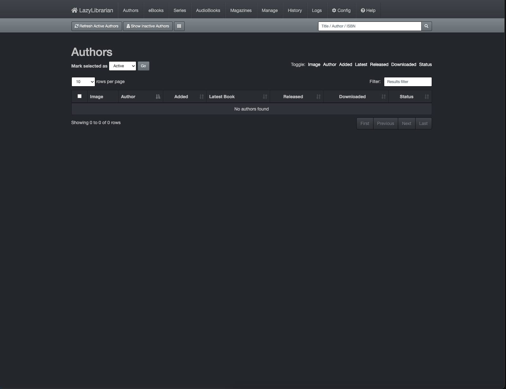

<!-- generated -->

# LazyLibrarian

1-Click installation template for LazyLibrarian on Easypanel

## Description

LazyLibrarian is an open-source tool designed to manage and automate the downloading, organizing, and serving of eBooks, audiobooks, and magazines. It integrates seamlessly with Usenet and torrent services to fetch content based on user preferences. With LazyLibrarian, you can search, download, and manage your media library effortlessly. It supports multiple download providers, metadata retrieval, and integration with Calibre for organizing your eBook collection. LazyLibrarian is user-friendly, flexible, and provides a centralized solution for book lovers to manage their digital libraries.

## Benefits

- Easy Media Management: LazyLibrarian simplifies managing eBooks, audiobooks, and magazines with automated downloads and metadata organization.
- Multiple Download Options: LazyLibrarian integrates with Usenet and torrent providers, giving you flexibility in how you fetch content.
- Metadata and Covers: Automatically fetch metadata and book covers for your collection to keep it organized and visually appealing.
- Integration with Calibre: Integrate LazyLibrarian with Calibre to organize and serve your eBook collection effortlessly.
- Open Source & Flexible: LazyLibrarian is open-source and customizable, allowing you to tailor it to your specific needs.

## Features

- eBook and Audiobook Support: LazyLibrarian manages both eBooks and audiobooks, making it a comprehensive solution for your media library.
- Automated Downloading: Automatically search for and download eBooks, audiobooks, and magazines based on your preferences.
- Multiple Providers: Supports a wide range of Usenet and torrent providers for flexible content fetching.
- Metadata Management: Fetch and manage metadata, including descriptions, covers, and authors for all your books.
- Integrated Search: Perform searches directly from LazyLibrarian’s interface across multiple download providers.
- Calibre Integration: Seamlessly integrate with Calibre to organize and serve your library efficiently.
- Web-Based Interface: Manage your library from any device with LazyLibrarian’s web-based user interface.
- Notifications: Receive notifications for downloads and updates via email or other supported services.
- Custom Filters: Customize filters to download only the content that matches your preferences.
- User-Friendly Setup: Easy to set up and configure, with detailed documentation for new users.

## Links

- [Website](https://lazylibrarian.gitlab.io)
- [Documentation](https://lazylibrarian.gitlab.io)
- [Github](https://gitlab.com/LazyLibrarian/LazyLibrarian)
- [Template Source](https://github.com/easypanel-io/templates/tree/main/templates/lazylibrarian)

## Options

Name | Description | Required | Default Value
-|-|-|-
App Service Name | - | yes | lazylibrarian
App Service Image | - | yes | lscr.io/linuxserver/lazylibrarian:latest

## Screenshots

## Change Log

- 2024-12-30 – First release

## Contributors

- [Ahson Shaikh](https://github.com/Ahson-Shaikh)
