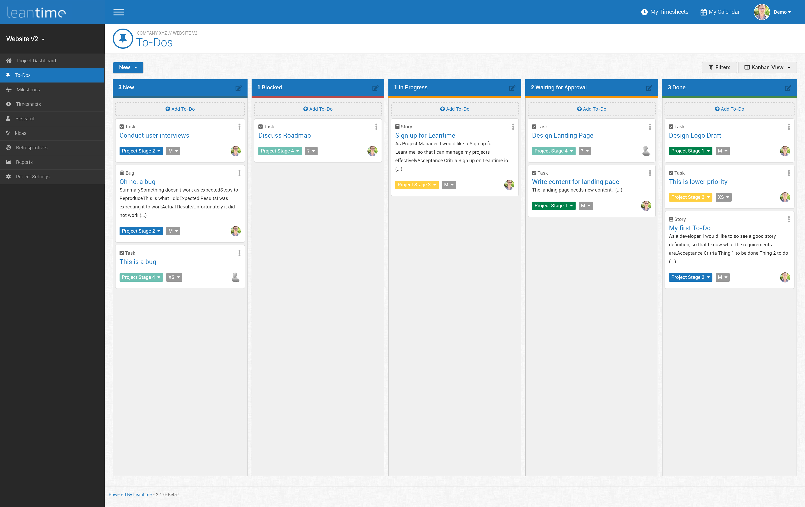

<!-- generated -->

# Leantime

1-Click installation template for Leantime on Easypanel

## Description

Leantime is an open-source project management system designed for startups and small teams. It offers a simple and intuitive interface to manage tasks, projects, and team collaboration efficiently. With Leantime, you can organize your work using timelines, kanban boards, and task lists. It also includes features like time tracking, milestones, and idea boards to streamline project workflows. Leantime supports integrations with various third-party tools, making it a flexible and scalable solution. Its emphasis on usability and simplicity ensures that teams can focus on productivity and achieving goals. Leantime is distributed under an open-source license, allowing for customization to meet the unique needs of any organization.

## Benefits

- Streamlined Project Management: Leantime provides tools like timelines, kanban boards, and task lists to help teams organize their projects and tasks efficiently.
- Scalable and Flexible: Leantime is suitable for startups and small teams, and it integrates with various third-party tools, ensuring adaptability to different workflows.
- Open Source and Customizable: Leantime is open-source, allowing teams to customize the platform to meet their unique project management needs.

## Features

- Task Management: Leantime enables users to manage tasks with an easy-to-use interface, ensuring that team members stay aligned on project goals.
- Time Tracking: Leantime includes built-in time tracking features, helping teams monitor the time spent on tasks and projects for better efficiency.
- Milestones and Deadlines: Leantime allows teams to set milestones and deadlines, ensuring that projects progress according to schedule.

## Links

- [Website](https://leantime.io/)
- [Documentation](https://docs.leantime.io/)
- [Github](https://github.com/Leantime/leantime)
- [Template Source](https://github.com/easypanel-io/templates/tree/main/templates/leantime)

## Options

Name | Description | Required | Default Value
-|-|-|-
App Service Name | - | yes | leantime
App Service Image | - | yes | leantime/leantime:3.3.2

## Screenshots

## Change Log

- 2025-01-13 – First Release

## Contributors

- [Ahson Shaikh](https://github.com/Ahson-Shaikh)
