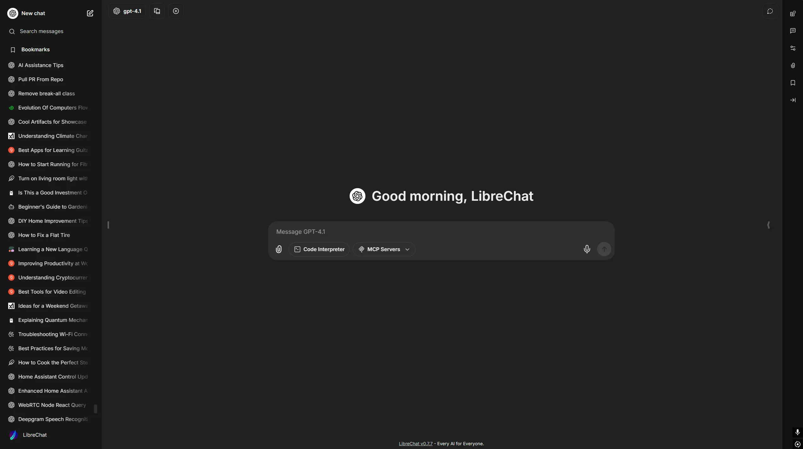

<!-- generated -->

# LibreChat

1-Click installation template for LibreChat on Easypanel

## Description

LibreChat is a free, open source clone of ChatGPT that supports multiple AI providers and models. It offers a familiar chat interface with support for OpenAI, Anthropic, Google, Azure OpenAI, and many other AI providers. LibreChat features conversation management, preset configurations, plugin support, multi-user authentication, and extensive customization options. It includes advanced features like RAG (Retrieval Augmented Generation), web search capabilities, file uploads, image generation, and comprehensive user management. Perfect for organizations and individuals who want ChatGPT-like functionality while maintaining full control over their data and conversations.

## Instructions

Configure the OpenAI API Key.

## Benefits

- Multi-Provider AI Support: Support for OpenAI, Anthropic, Google, Azure OpenAI, and many other AI providers in a single interface with seamless model switching.
- ChatGPT-like Experience: Familiar chat interface with conversation management, message editing, and all the features you expect from modern AI chat applications.
- RAG Capabilities: Upload and chat with your own documents using advanced Retrieval Augmented Generation with vector search and semantic understanding.
- Self-Hosted Privacy: Complete control over your conversations and data with self-hosted deployment, ensuring privacy and compliance with your requirements.
- Advanced Features: Plugin support, web search, image generation, file uploads, conversation presets, and extensive customization options.
- Multi-User Support: User authentication, role management, conversation sharing, and administration tools for team and organizational use.
- Enterprise Ready: Scalable architecture with database persistence, search capabilities, and comprehensive configuration options for production use.

## Features

- Multiple AI Providers: Connect to OpenAI, Anthropic, Google, Azure OpenAI, and dozens of other AI providers through a unified chat interface.
- Conversation Management: Organize conversations, search chat history, export conversations, and manage multiple concurrent chats with different models.
- RAG Integration: Upload documents and chat with your own data using vector embeddings and semantic search for context-aware responses.
- Plugin System: Extend functionality with plugins for web search, image generation, code execution, and integration with external services.
- User Authentication: Secure user management with email authentication, social login options, and role-based access controls.
- Preset Configurations: Create and share conversation presets with custom prompts, parameters, and model configurations for consistent interactions.
- File Upload Support: Upload and share files in conversations, including images, documents, and other media with AI analysis capabilities.
- Search Functionality: Powerful search across all conversations and uploaded content using Meilisearch for fast and accurate results.
- Admin Dashboard: Comprehensive administration interface for user management, system configuration, and monitoring of application usage.
- API Integration: RESTful API for programmatic access, webhook support, and integration with external applications and workflows.

## Links

- [Website](https://librechat.ai)
- [Documentation](https://docs.librechat.ai)
- [GitHub](https://github.com/danny-avila/LibreChat)
- [Template Source](https://github.com/easypanel-io/templates/tree/main/templates/librechat)

## Options

Name | Description | Required | Default Value
-|-|-|-
App Service Name | - | yes | librechat
LibreChat Image | - | yes | ghcr.io/danny-avila/librechat-dev:aec1777a90c03314ff5dd9e218c7ce179181eba2
Meilisearch Image | - | yes | getmeili/meilisearch:v1.12.3
Vector Database Image | - | yes | ankane/pgvector:v0.5.1
RAG API Image | - | yes | ghcr.io/danny-avila/librechat-rag-api-dev-lite:8cc6695544457e4164d6f8275f0805f051f363af
Application Title | The title displayed in the application header | yes | LibreChat
Allow Email Login | Enable email/password authentication | yes | true
Allow Registration | Allow new users to register accounts | yes | true
OpenAI API Key | The API key for the OpenAI provider | yes | 

## Screenshots

## Change Log

- 2025-07-21 – Initial release (aec1777a90c03314ff5dd9e218c7ce179181eba2)

## Contributors

- [Ahson Shaikh](https://github.com/Ahson-Shaikh)
