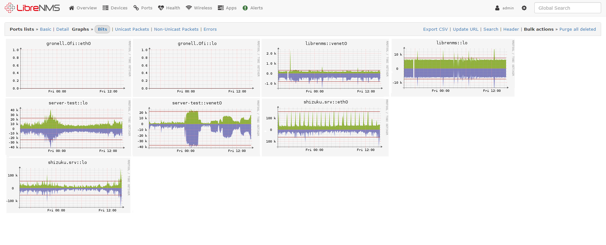

<!-- generated -->

# LibreNMS

1-Click installation template for LibreNMS on Easypanel

## Description

LibreNMS is a fully featured network monitoring system that provides a wealth of features and device support. It includes support for multiple authentication methods, API access, alerting, and automatic discovery.

## Benefits

- Network Monitoring: Monitor your network devices and services
- Auto Discovery: Automatically discover and add network devices
- Alerting: Get notified about network issues
- Self-Hosted: Keep your monitoring data private and secure

## Features

- Device Monitoring: Monitor network devices and services
- Performance Graphs: View performance metrics and graphs
- Alerting System: Configure alerts for network issues
- API Access: Access data through REST API
- Multi-User Support: Support for multiple users with different roles

## Links

- [Website](https://www.librenms.org)
- [Documentation](https://docs.librenms.org)
- [Template Source](https://github.com/easypanel-io/templates/tree/main/templates/librenms)

## Options

Name | Description | Required | Default Value
-|-|-|-
App Service Name | - | yes | librenms
App Service Image | - | yes | librenms/librenms:25.3.0
SMTP Host | - | yes | smtp.gmail.com
SMTP Port | - | yes | 587
SMTP User | - | yes | foo
SMTP Password | - | yes | 
SMTP From | - | yes | foo@gmail.com

## Screenshots

## Change Log

- 2025-04-14 – First Release

## Contributors

- [Ahson Shaikh](https://github.com/Ahson-Shaikh)
