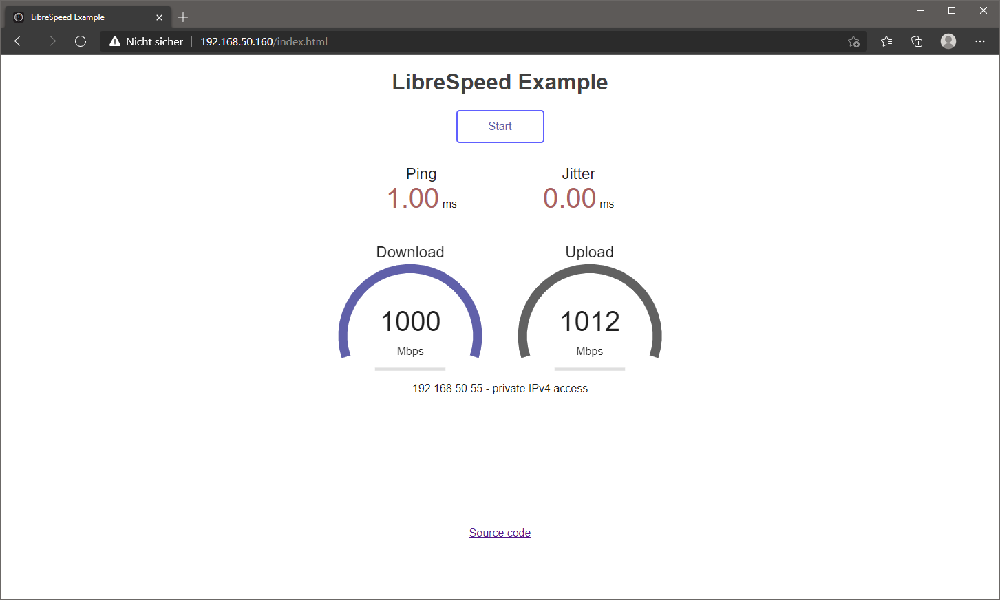

<!-- generated -->

# LibreSpeed

1-Click installation template for LibreSpeed on Easypanel

## Description

LibreSpeed is a free and open-source HTML5-based speed test application that you can host on your own server. It provides a lightweight, self-hosted alternative to commercial speed test services like Speedtest.net. LibreSpeed allows you to measure download speed, upload speed, ping, and jitter of your internet connection through a clean, modern web interface. It&#39;s perfect for network administrators, ISPs, or anyone who wants to monitor their internet connection performance without relying on third-party services. The application stores test results and provides analytics to track connection quality over time.

## Instructions

Leave &quot;Results Password&quot; empty to auto-generate a strong password at deploy time, or set your own value if you want a fixed credential. After deployment, open LibreSpeed from your app domain and use the configured password to access historical test results.

## Benefits

- Self-Hosted Speed Testing: Host your own speed test server to measure internet connection performance without relying on third-party services or sharing data externally.
- Privacy-Focused: Keep all speed test data on your own infrastructure, ensuring complete privacy and control over your network performance metrics.
- Lightweight & Fast: Minimal resource usage with HTML5-based testing that works across all modern browsers without requiring plugins or additional software.
- Results Tracking: Store and analyze historical speed test results to monitor connection quality trends and identify performance issues over time.

## Features

- Download Speed Test: Accurately measure your internet download speed with configurable test parameters and detailed performance metrics.
- Upload Speed Test: Test your upload bandwidth with precise measurements to understand your connection's full capabilities in both directions.
- Ping & Jitter Measurement: Monitor connection latency and stability with ping and jitter tests to identify network quality issues beyond just bandwidth.
- Results Database: Automatically store test results with password-protected access for reviewing historical performance data and trends.
- Clean Web Interface: Modern, responsive HTML5 interface that works seamlessly across desktop and mobile devices without requiring any plugins.
- Geolocation Support: Optional integration with IPInfo API for enhanced geolocation data to track test results by location and ISP information.

## Links

- [GitHub](https://github.com/librespeed/speedtest)
- [Documentation](https://docs.linuxserver.io/images/docker-librespeed/)
- [Demo](https://librespeed.org/)
- [Template Source](https://github.com/easypanel-io/templates/tree/main/templates/librespeed)

## Options

Name | Description | Required | Default Value
-|-|-|-
App Service Name | - | yes | librespeed
App Service Image | LibreSpeed Docker image from LinuxServer.io | yes | lscr.io/linuxserver/librespeed:5.4.1
Results Password | Leave empty to auto-generate a random password, or set one manually to access test results and statistics | no | 
Enable Custom Results | Enable custom results page | no | false
IPInfo API Key | Optional API key from ipinfo.io for enhanced geolocation data | no | 

## Screenshots

## Change Log

- 2025-10-21 – Initial Template Release (v5.4.1)

## Contributors

- [Ahson Shaikh](https://github.com/Ahson-Shaikh)
