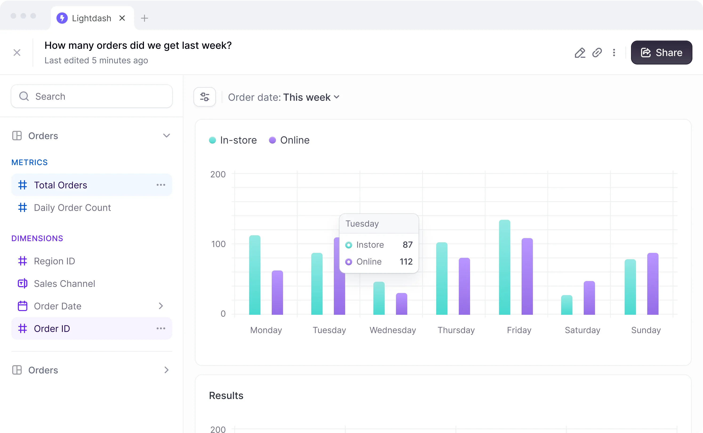

<!-- generated -->

# LightDash

1-Click installation template for LightDash on Easypanel

## Description

LightDash is a modern, open-source business intelligence (BI) and data exploration tool designed to help teams visualize and understand their data. It connects directly to your existing data warehouse and provides an intuitive interface for building and sharing dashboards. With LightDash, you can create actionable insights from your data without needing advanced technical skills.

## Instructions

Configure the Environmental Variables as per the requirements.

## Benefits

- Data Exploration Made Simple: LightDash simplifies exploring and visualizing your data with an intuitive interface designed for both technical and non-technical users.
- Direct Integration: Connects directly to your data warehouse, ensuring real-time access to your latest data without replication.
- Open Source: Benefit from community-driven innovation and customization with a fully open-source solution.

## Features

- Interactive Dashboards: Build and share interactive dashboards for team-wide collaboration and insights.
- SQL-Based Metrics: Define and reuse metrics across multiple dashboards using a familiar SQL-based approach.
- Role-Based Access Control: Secure your data with fine-grained permissions and role-based access controls.
- Data Transformation: Transform and model your data directly within LightDash to meet specific analysis needs.

## Links

- [Documentation](https://docs.lightdash.com/)
- [Github](https://github.com/lightdash/lightdash)
- [Template Source](https://github.com/easypanel-io/templates/tree/main/templates/lightdash)

## Options

Name | Description | Required | Default Value
-|-|-|-
App Service Name | - | yes | lightdash
App Service Image | - | yes | lightdash/lightdash:0.1447.1
Browserless Image | - | yes | browserless/chrome

## Screenshots

## Change Log

- 2025-01-10 – Template Release

## Contributors

- [Ahson Shaikh](https://github.com/Ahson-Shaikh)
