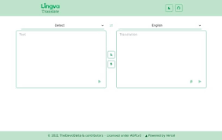

<!-- generated -->

# Lingva Translate

1-Click installation template for Lingva Translate on Easypanel

## Description

Lingva Translate is a free, open-source alternative front-end for Google Translate. Supports 100+ languages via scraping—no direct Google access, no user tracking. Built with Next.js and ChakraUI. Provides REST API for translation, audio, and language detection. Privacy-focused translation.

## Instructions

After deployment, access the web UI on your assigned domain. Set the site
domain to your public URL (e.g. https://lingva.yourdomain.com) for correct
API links. Use the REST API at /api/v1/:source/:target/:query for translations.

## Benefits

- Privacy-Focused: No direct Google access; no user tracking
- 100+ Languages: Full Google Translate language support
- REST API: Translation, audio, and language detection endpoints
- Self-Hosted: Your own translation front-end

## Features

- Web Interface: Clean UI for text translation
- API Endpoints: /api/v1/:source/:target/:query, /api/v1/audio/:lang/:query
- Theme Support: Light or dark theme
- Language Detection: Auto-detect source language

## Links

- [Website](https://lingva.thedaviddelta.com)
- [GitHub](https://github.com/TheDavidDelta/lingva-translate)
- [Docker Hub](https://hub.docker.com/r/thedaviddelta/lingva-translate)
- [Template Source](https://github.com/easypanel-io/templates/tree/main/templates/lingva)

## Options

Name | Description | Required | Default Value
-|-|-|-
App Service Name | - | yes | lingva
App Service Image | - | yes | thedaviddelta/lingva-translate:latest
Site Domain | Your public URL (e.g. https://lingva.yourdomain.com). Leave blank to use assigned domain. | no | 
Default Theme | - | no | light
Default Source Language | Initial source language (auto for detection) | no | auto
Default Target Language | - | no | en

## Screenshots

## Change Log

- 2026-03-17 – First Release

## Contributors

- [Ahson Shaikh](https://github.com/Ahson-Shaikh)
