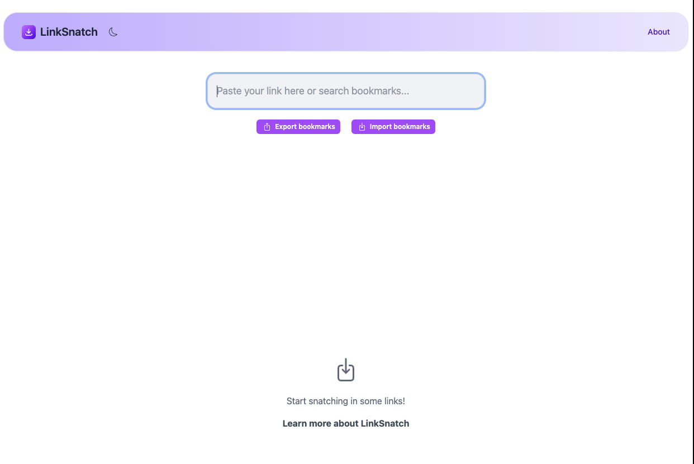

<!-- generated -->

# Linksnatch

1-Click installation template for Linksnatch on Easypanel

## Description

Linksnatch is a link management application that helps you organize and track your bookmarks and URLs. It provides a simple interface for managing and categorizing your links.

## Benefits

- Link Management: Organize and manage your bookmarks efficiently
- Simple Interface: User-friendly interface for easy link management
- Categorization: Organize links into categories and tags
- Self-Hosted: Keep your bookmarks private and secure

## Features

- Link Storage: Store and manage your bookmarks
- Categories: Organize links into categories
- Tags: Add tags to links for better organization
- Search: Search through your saved links
- Export: Export your bookmarks in various formats

## Links

- [GitHub](https://github.com/amitmerchant1990/linksnatch)
- [Template Source](https://github.com/easypanel-io/templates/tree/main/templates/linksnatch)

## Options

Name | Description | Required | Default Value
-|-|-|-
App Service Name | - | yes | linksnatch
App Service Image | - | yes | varunsridharan/linksnatch:1.0

## Screenshots

## Change Log

- 2025-04-11 – First Release

## Contributors

- [Ahson Shaikh](https://github.com/Ahson-Shaikh)
