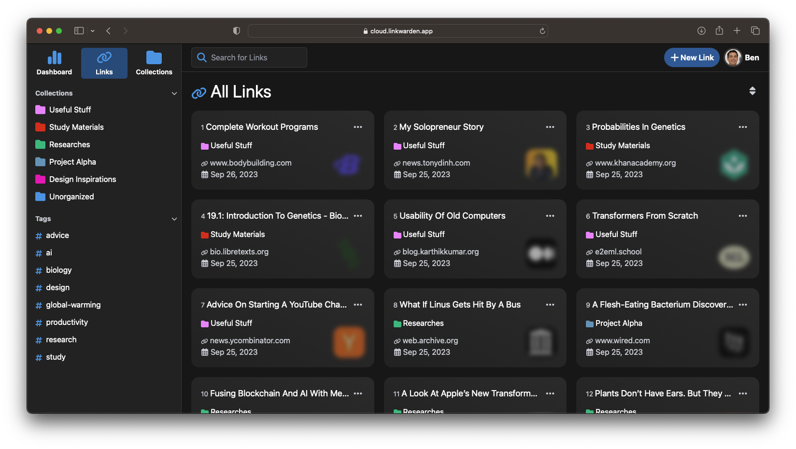

<!-- generated -->

# LinkWarden

1-Click installation template for LinkWarden on Easypanel

## Description

LinkWarden is a powerful, self-hosted service designed for managing and archiving bookmarks. It provides an intuitive interface for organizing and accessing your saved links, supports advanced features for enhanced productivity, and offers detailed link preservation options. With LinkWarden, you can maintain control over your bookmarks and ensure they remain accessible.

## Instructions

Configure Environment Variables as per your needs.

## Benefits

- Advanced Bookmark Management: LinkWarden allows you to organize, manage, and preserve your bookmarks efficiently through its intuitive web interface.
- Self-Hosted Solution: Stay in control of your bookmarks with a self-hosted service, ensuring privacy and customization.
- Enhanced Productivity: Access advanced features like tag management, link archiving, and note-taking to streamline your workflow.

## Features

- Bookmark Archiving: Preserve web pages and links with offline access for long-term reliability.
- Tag and Folder Organization: Organize your bookmarks effectively with tags and folders for quick retrieval.
- Shareable Collections: Create and share bookmark collections with team members or friends.
- Analytics Dashboard: Gain insights into bookmark usage and access trends for better resource management.

## Links

- [Documentation](https://linkwarden.app/docs)
- [Github](https://github.com/linkwarden/linkwarden)
- [Template Source](https://github.com/easypanel-io/templates/tree/main/templates/linkwarden)

## Options

Name | Description | Required | Default Value
-|-|-|-
App Service Name | - | yes | linkwarden
App Service Image | - | yes | ghcr.io/linkwarden/linkwarden:v2.9.3

## Screenshots

## Change Log

- 2025-01-16 – Template Release

## Contributors

- [Ahson Shaikh](https://github.com/Ahson-Shaikh)
