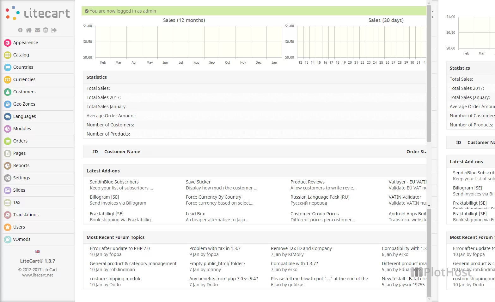

<!-- generated -->

# LiteCart

1-Click installation template for LiteCart on Easypanel

## Description

LiteCart is a free and open-source e-commerce platform that provides a complete solution for creating and managing online stores. It features a user-friendly interface, customizable themes, and essential e-commerce functionality including product management, order processing, and customer management. LiteCart is built with PHP and MySQL, making it easy to deploy and maintain.

## Benefits

- User-Friendly: Intuitive interface and easy-to-use admin panel for managing your online store.
- Complete E-commerce Solution: Provides all essential features for running an online store including product management, order processing, and customer management.
- Customizable: Offers customizable themes and extensions to meet your specific business needs.
- Open Source: Free and open-source platform with an active community for support and improvements.
- Easy Deployment: Simple deployment process with Docker, making it easy to set up and maintain your online store.

## Features

- Product Management: Manage products with detailed information, categories, and inventory tracking.
- Order Processing: Process orders with payment integration, shipping options, and order status tracking.
- Customer Management: Manage customers with profiles, addresses, and order history.
- Payment Integration: Integrate with popular payment gateways for secure transactions.
- Shipping Integration: Integrate with shipping carriers for accurate shipping calculations.

## Links

- [Website](https://www.litecart.net/)
- [Documentation](https://www.litecart.net/en/wiki/)
- [Github](https://github.com/litecart/litecart)
- [Template Source](https://github.com/easypanel-io/templates/tree/main/templates/litecart)

## Options

Name | Description | Required | Default Value
-|-|-|-
App Service Name | - | yes | litecart
App Service Image | - | yes | shurco/litecart:v0.2.6

## Screenshots

## Change Log

- 2024-04-04 – First Release
- 2026-05-04 – Version bumped to v0.2.6

## Contributors

- [Ahson Shaikh](https://github.com/Ahson-Shaikh)
