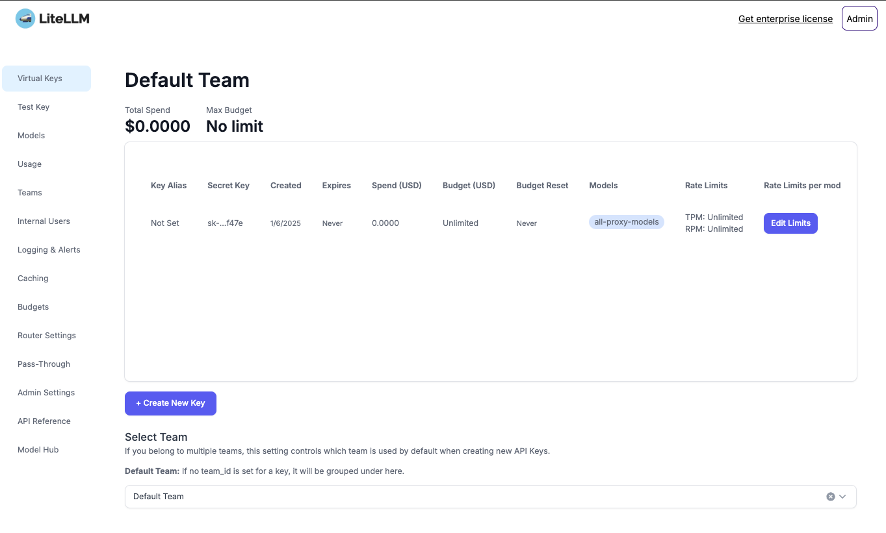

<!-- generated -->

# LiteLLM

1-Click installation template for LiteLLM on Easypanel

## Description

LiteLLM is a lightweight, self-hosted library designed for integrating language models like GPT into your applications. It provides an easy-to-use interface for sending and receiving prompts and responses, with support for multiple model configurations, API keys, and detailed debugging options. With LiteLLM, you can streamline your AI workflows while maintaining full control over your data and configurations.

## Instructions

Use the provided master-key as the password for UI login.

## Benefits

- Easy Integration: LiteLLM simplifies the process of integrating language models into your applications with minimal setup.
- Self-Hosted Flexibility: Maintain full control over your AI integrations by hosting LiteLLM on your own infrastructure.
- Detailed Debugging: Enable detailed logs and debugging to optimize and troubleshoot your AI workflows.

## Features

- Multi-Model Support: Configure and use multiple language models easily within the same setup.
- API Key Management: Securely manage API keys and other sensitive information through environment variables.
- Debugging Tools: Access detailed logs to monitor requests, responses, and configurations.
- Lightweight Setup: Run LiteLLM with minimal resource requirements for efficient AI integration.

## Links

- [Documentation](https://docs.litellm.ai/docs/)
- [Github](https://github.com/berriai/litellm)
- [Template Source](https://github.com/easypanel-io/templates/tree/main/templates/litellm)

## Options

Name | Description | Required | Default Value
-|-|-|-
App Service Name | - | yes | litellm
App Service Image | - | yes | ghcr.io/berriai/litellm:main-v1.57.0

## Screenshots

## Change Log

- 2025-01-06 – Initial Template Release for LiteLLM

## Contributors

- [Ahson Shaikh](https://github.com/Ahson-Shaikh)
