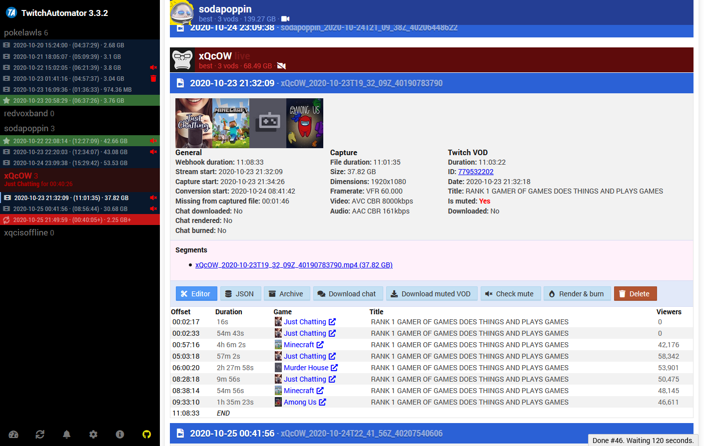

<!-- generated -->

# LiveStreamDVR

1-Click installation template for LiveStreamDVR on Easypanel

## Description

LiveStreamDVR (formerly TwitchAutomator) is a powerful tool for automatically recording and archiving live streams from Twitch. It provides a web interface to manage recordings, schedule streams to record, and organize your VOD library.

## Instructions

After installation, access the web interface through the provided domain to start configuring your stream recordings.

## Benefits

- Automated Recording: Automatically record live streams from your favorite Twitch channels.
- Web Interface: Manage your recordings through an intuitive web interface.
- VOD Library: Build and organize your personal VOD library.
- Scheduling: Schedule recordings in advance for upcoming streams.
- Storage Management: Efficiently manage your recorded content with built-in storage tools.

## Features

- Stream Recording: Record live streams in their original quality.
- Channel Management: Add and manage multiple Twitch channels.
- Recording Schedule: Set up automatic recording schedules.
- Storage Options: Configure storage locations and manage space.
- Web Dashboard: Monitor and control recordings through a web interface.

## Links

- [Github](https://github.com/MrBrax/LiveStreamDVR)
- [Template Source](https://github.com/easypanel-io/templates/tree/main/templates/livestreamdvr)

## Options

Name | Description | Required | Default Value
-|-|-|-
App Service Name | - | yes | livestreamdvr
App Service Image | - | yes | mrbrax/twitchautomator:master

## Screenshots

## Change Log

- 2024-04-09 – First Release

## Contributors

- [MrBrax](https://github.com/Ahson-Shaikh)
