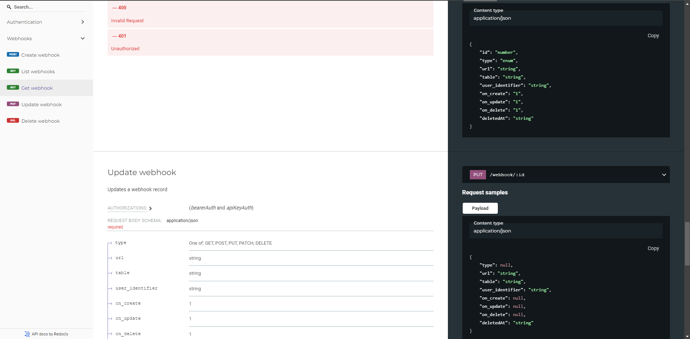

<!-- generated -->

# llana

1-Click installation template for llana on Easypanel

## Description

Llana is a lightweight no-code API wrapper that exposes a REST API for any database within minutes. Stop wasting time building endpoints, just connect your database and start playing. Open source, free to use, and no vendor lock-in.

## Benefits

- No-Code API Generation: Automatically generate REST APIs for your database within minutes without writing any code. Connect, configure, and go!
- Open Source and Free: Llana is open-source, free to use, and ensures no vendor lock-in, giving you full control of your data and infrastructure.
- Lightweight and Fast: Designed for high performance with minimal resource usage, Llana is perfect for both small and large-scale applications.

## Features

- Instant REST API: Generate REST APIs for any database instantly. Expose endpoints to query, insert, update, and delete records.
- Multi-Database Support: Connect to PostgreSQL, MySQL, and other popular databases seamlessly.
- Authentication and Security: Secure your API with JWT-based authentication and configurable security rules.
- Easy Configuration: Set up Llana with a simple configuration file. No complex coding required.
- Vendor Lock-In Free: Run Llana on your own servers or infrastructure without being tied to any platform.
- Extendable: Customize and extend Llana to fit your application's needs through open-source contributions.

## Links

- [Website](https://llana.io/)
- [GitHub](https://github.com/juicyllama/llana)
- [Template Source](https://github.com/easypanel-io/templates/tree/main/templates/llana)

## Options

Name | Description | Required | Default Value
-|-|-|-
Application Service Name | - | yes | llana
Application Service Image | - | yes | juicyllama/llana:v1.14
Database Type | - | yes | postgresql
Database Hostname | - | yes | 
Database Username | - | yes | 
Database Password | - | yes | 
Database Port | - | yes | 
Database Name | - | yes | 
JWT Secret | Provide a 32-character long JWT secret. | yes | 

## Screenshots

## Change Log

- 2024-12-10 – First release

## Contributors

- [Ahson Shaikh](https://github.com/Ahson-Shaikh)
