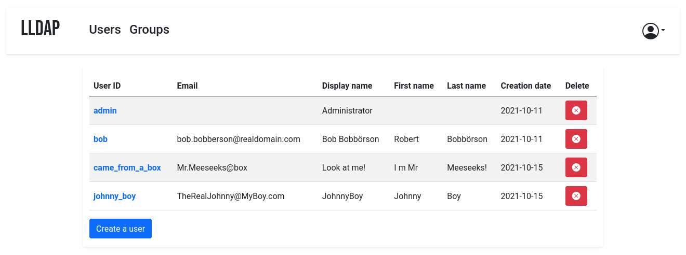

<!-- generated -->

# LLDAP

1-Click installation template for LLDAP on Easypanel

## Description

LLDAP (Lightweight LDAP) is a simple, lightweight, high-performance LDAP server designed for authentication in small to medium-sized deployments. It provides an intuitive web UI for user management and a complete implementation of LDAP search and bind operations. LLDAP is perfect for self-hosted applications that require LDAP authentication without the complexity of full-featured LDAP servers like OpenLDAP. It stores user data in an embedded SQLite database by default but also supports PostgreSQL, making it easy to set up and maintain. With features like password hashing, account creation/deletion, group management, and MFA support, LLDAP offers a modern solution for identity management in your self-hosted infrastructure.

## Instructions

Login using the username &quot;admin&quot; and the password you would decide.

## Benefits

- Simple User Management: Manage users and groups through an intuitive web UI without needing to understand LDAP complexities.
- Lightweight and Fast: Designed for performance and minimal resource usage while providing all essential LDAP functionality.
- Easy Integration: Seamlessly connect with applications that support LDAP authentication, including Nextcloud, Jellyfin, and many others.

## Features

- Web-Based Administration: Create and manage users, groups, and permissions through a modern web interface without LDAP expertise.
- LDAP Standard Compliance: Full implementation of LDAP search and bind operations for compatibility with existing applications.
- Multi-Factor Authentication: Enhanced security with time-based one-time password (TOTP) support for two-factor authentication.
- Password Policy Enforcement: Configure password requirements including minimum length, complexity, and expiration policies.

## Links

- [GitHub](https://github.com/nitnelave/lldap)
- [Docker Hub](https://hub.docker.com/r/nitnelave/lldap)
- [Template Source](https://github.com/easypanel-io/templates/tree/main/templates/lldap)

## Options

Name | Description | Required | Default Value
-|-|-|-
App Service Name | - | yes | lldap
App Service Image | - | yes | lldap/lldap:2025-07-22
Admin Password | - | yes | adminPassword
Exposed Port | - | yes | 3890

## Screenshots

## Change Log

- 2025-03-22 – Initial template release
- 2025-07-22 – Version bumped to 2025-07-22

## Contributors

- [Ahson Shaikh](https://github.com/Ahson-Shaikh)
