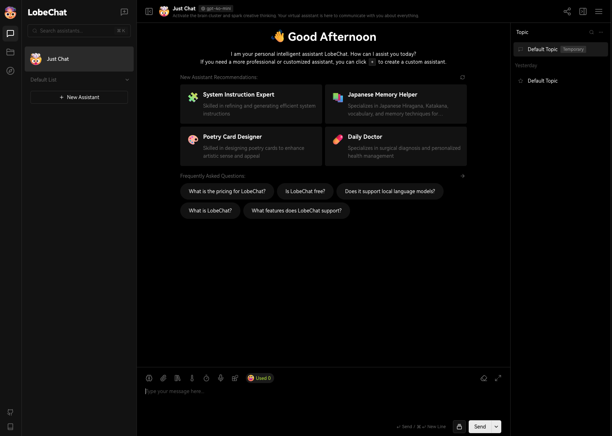

<!-- generated -->

# LobeChat

1-Click installation template for LobeChat on Easypanel

## Description

LobeChat is an open-source, AI-powered chat application designed to integrate with OpenAI services. It provides a seamless user experience, combining conversational AI capabilities with a customizable and extensible architecture. LobeChat is ideal for both personal and professional use cases, offering robust features for modern AI chat applications.

## Instructions

Configure your OpenAI API key and proxy URL to start using the application.

## Benefits

- AI-Powered Conversations: LobeChat leverages OpenAI's powerful models to provide intelligent, real-time conversational experiences for users.
- Easy Integration with OpenAI: Simplify AI setup with quick integration of OpenAI API keys and proxy configurations, allowing users to get started effortlessly.
- Full Customization: LobeChat offers extensive options for customizing chat workflows, user interfaces, and integration points for enhanced flexibility.

## Features

- OpenAI Integration: Seamlessly connect to OpenAI services for delivering cutting-edge conversational AI capabilities in your chat applications.
- Access Control with Secure Codes: Protect your chat application with access codes, ensuring only authorized users can interact with the AI service.
- Multi-Platform Support: LobeChat works across platforms, including web and containerized environments, providing versatility in deployment.
- Extensible Architecture: Built for developers, LobeChat's architecture allows you to add new integrations, APIs, or features with minimal effort.
- User-Friendly UI: LobeChat includes a clean, intuitive interface for a smooth user experience, enabling quick adoption and usage.

## Links

- [Website](https://lobehub.com/)
- [Compose Docs](https://lobehub.com/docs/self-hosting/server-database/docker-compose)
- [Documentation](https://lobehub.com/docs/usage/start)
- [Github](https://github.com/lobehub/lobe-chat)
- [Template Source](https://github.com/easypanel-io/templates/tree/main/templates/lobechat)

## Options

Name | Description | Required | Default Value
-|-|-|-
App Service Name | - | yes | lobechat
App Service Image | - | yes | lobehub/lobe-chat:v1.36.25
OpenAI API Key | OpenAI API Key for enabling AI functionalities. | yes | sk-xxxx
OpenAI Proxy | Proxy URL for accessing OpenAI API securely. | yes | https://api-proxy.com/v1
Access Code | Access code for secure authentication to the chat service. | yes | lobe66

## Screenshots

## Change Log

- 2024-12-16 – First release

## Contributors

- [Ahson Shaikh](https://github.com/Ahson-Shaikh)
