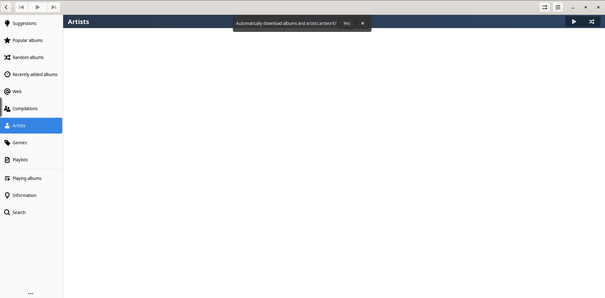

<!-- generated -->

# Lollypop

1-Click installation template for Lollypop on Easypanel

## Description

Lollypop is a self-hosted, high-performance music library manager and player. It is designed to handle extensive music collections, offering a sleek and modern interface for browsing, organizing, and playing your favorite tracks. The app supports multiple audio formats, playlists, and smart sorting options. Lollypop integrates seamlessly with online services to fetch album artwork, lyrics, and artist information. It also provides a simple API for managing playlists and controlling playback remotely. Lollypop is open-source, free, and designed to run efficiently on minimal hardware, making it a lightweight yet powerful solution for all your music needs.

## Benefits

- Modern Interface: Lollypop features a sleek and modern interface that makes it easy to browse, organize, and play your music collection.
- Multi-Format Support: Supports multiple audio formats, allowing you to play all your favorite tracks without any compatibility issues.
- Lightweight: Lollypop is designed to run efficiently on minimal hardware, making it a perfect choice for users looking for a lightweight music player.

## Features

- Music Library Management: Organize and browse your music library with smart sorting options, playlists, and metadata fetching for tracks.
- Remote API: Lollypop provides a simple API to manage playlists and control playback remotely from other devices.
- Extensibility: Integrate with online services to fetch album artwork, lyrics, and artist information for an enriched listening experience.
- Performance: Lollypop is optimized for high performance and minimal resource usage, ensuring smooth playback and library management.
- Open Source: Free and open-source software, allowing the community to contribute to its features and enhancements.

## Links

- [Website](https://lollypop.app/)
- [Documentation](https://lollypop.app/docs/)
- [Github](https://github.com/linuxserver/lollypop)
- [Template Source](https://github.com/easypanel-io/templates/tree/main/templates/lollypop)

## Options

Name | Description | Required | Default Value
-|-|-|-
App Service Name | - | yes | lollypop
App Service Image | - | yes | lscr.io/linuxserver/lollypop:latest

## Screenshots

## Change Log

- 2024-12-30 – First Release

## Contributors

- [Ahson Shaikh](https://github.com/Ahson-Shaikh)
