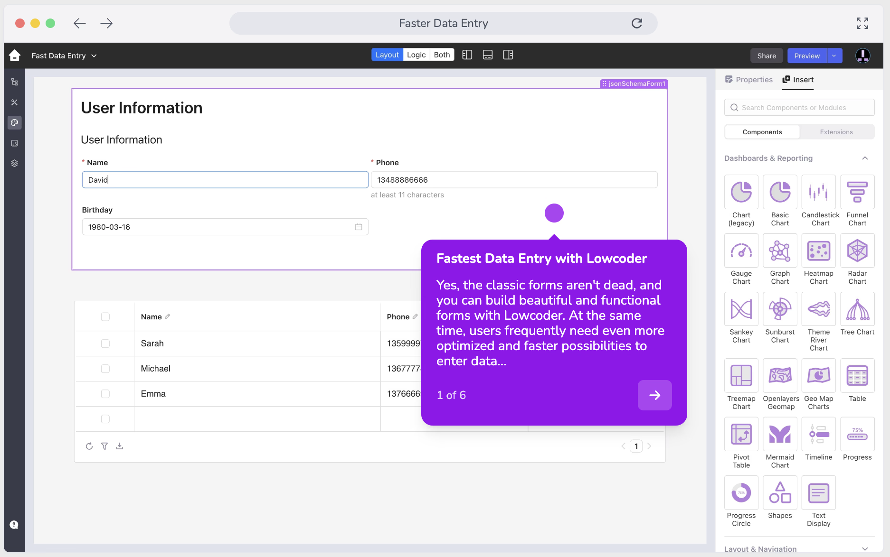

<!-- generated -->

# Lowcoder

1-Click installation template for Lowcoder on Easypanel

## Description

Open-source low-code platform to build internal tools with minimal effort.

## Benefits

- Build Internal Tools Fast: Create applications without extensive coding knowledge.
- Connect to Multiple Data Sources: Integrate with databases, APIs, and other services.
- Self-Hosted Solution: Complete control over your data and infrastructure.

## Features

- Visual Development: Drag-and-drop interface for building applications.
- Data Integration: Connect to various data sources with minimal configuration.
- User Management: Built-in authentication and user permission controls.
- Customizable Components: Extensive library of UI components and templates.

## Links

- [Website](https://lowcoder.org/)
- [Documentation](https://docs.lowcoder.org/)
- [Github](https://github.com/lowcoder-org/lowcoder)
- [Template Source](https://github.com/easypanel-io/templates/tree/main/templates/lowcoder)

## Options

Name | Description | Required | Default Value
-|-|-|-
Service Name | - | yes | lowcoder
API Service Image | - | yes | lowcoderorg/lowcoder-ce-api-service:2.6.5
Node Service Image | - | yes | lowcoderorg/lowcoder-ce-node-service:2.6.5
Frontend Image | - | yes | lowcoderorg/lowcoder-ce-frontend:2.6.5
Superuser Username | - | yes | admin@localhost
Superuser Password | - | yes | password
SMTP Host | - | yes | smtp.gmail.com
SMTP Port | - | yes | 587
SMTP Username | - | yes | your-email@gmail.com
SMTP Password | - | yes | your-password
Notification Email Sender | - | yes | info@localhost

## Screenshots

## Change Log

- 2025-05-26 – First release

## Contributors

- [Ahson Shaikh](https://github.com/Ahson-Shaikh)
