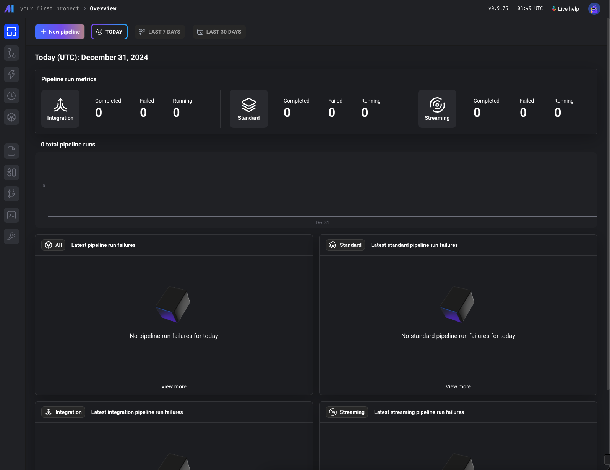

<!-- generated -->

# Mage-AI

1-Click installation template for Mage-AI on Easypanel

## Description

Mage-AI is a powerful open-source data pipeline tool designed to simplify and accelerate building, deploying, and managing machine learning workflows. It empowers data engineers and scientists with a unified platform to seamlessly create pipelines for data ingestion, transformation, and model deployment. With Mage-AI&#39;s user-friendly interface and robust features, it becomes an essential tool for teams aiming to deliver AI solutions efficiently and effectively.

## Benefits

- Unified Data Workflows: Mage-AI provides a single interface to design and execute complex data pipelines, streamlining the machine learning process.
- Easy Integration: Integrates seamlessly with existing tools and platforms, enabling flexible and scalable pipeline deployments.
- Open-Source Advantage: Leverage the power of open-source development for maximum customization and community support.
- User-Friendly Interface: A web-based interface simplifies the creation and management of pipelines without extensive coding knowledge.
- Scalable Architecture: Scales efficiently to handle projects of any size, from small experiments to enterprise-level solutions.

## Features

- Data Pipeline Automation: Automate data ingestion, transformation, and processing tasks to reduce manual effort and improve productivity.
- Customizable Components: Easily customize and extend pipeline components to meet your specific project requirements.
- Real-Time Monitoring: Monitor pipeline performance in real-time with detailed metrics and logs.
- Model Deployment: Simplify model deployment to production environments with Mage-AI's integrated tools.
- Seamless Cloud Integration: Supports deployment on popular cloud platforms for flexible and scalable infrastructure.
- Collaborative Environment: Enables team collaboration with shared pipelines and configurations.
- Version Control: Built-in version control helps track changes and revert to previous states when needed.
- Multi-Language Support: Supports Python, SQL, and other languages for building diverse and robust pipelines.
- Advanced Orchestration: Schedule, run, and manage multiple pipelines with ease using advanced orchestration features.
- Lightweight Deployment: Deploy lightweight containers with minimal resource consumption for high performance.

## Links

- [Website](https://docs.mage.ai/introduction/overview)
- [Documentation](https://docs.mage.ai/)
- [Github](https://github.com/mage-ai/mage-ai)
- [Template Source](https://github.com/easypanel-io/templates/tree/main/templates/mageai)

## Options

Name | Description | Required | Default Value
-|-|-|-
App Service Name | - | yes | mage-ai
App Service Image | - | yes | mageai/mageai:latest
Project Name | - | yes | my-first-project

## Screenshots

## Change Log

- 2024-12-31 – First Release

## Contributors

- [Ahson Shaikh](https://github.com/Ahson-Shaikh)
